--- 
title: "Air pollution in Barcelona"
author: "Jone Lerchundi"
date: "2019-06-07"
output:
  bookdown::html: default
  #bookdown::gitbook: default
site: bookdown::bookdown_site
#github-repo: rstudio/bookdown-demo
#site: bookdown::bookdown_site
description: "This is my final thesis for my Masters in Data Science about pollution in Barcelona."
---

# Preface {-}

 > “It is a capital mistake to theorize before one has data.” Sherlock Holmes, “A Study in Scarlett” (Arthur Conan Doyle)
 
My name is Jone Lerchundi and I have worked as a BI consultant for more than 8 years helping companies to understand and leverage useful insights from data. Following my passion for data, I have recently studied a [Masters in Data Science](https://kschool.com/cursos/master-en-data-science-barcelona/) (13th promotion) at Kschool with the idea of expanding my skills and learning new tools and ideas that data science offers to better understand, capture and explain stories from data.

This thesis has been written as a final project for my Masters in Data Science, but it is also a personal project as I am committed to also using my analytical skills to fight the current climate and environmental  emergency that we are facing. This is a work in progress project and my intention is to continue getting useful insights and information and share them for further conciousness.

I am still learning so if you see anything wrong in my code or my assumptions, or you have any questions or new ideas that can help with this project, please don't hesitate to contact me, I will be more than happy to hear from you. 

You can find me in my [Linkedin profile](www.linkedin.com/in/jonelerchundi). 

# Introduction {#intro}

##Motivation

Air pollution is a silent, sometimes invisible, killler that is responsible for the premature death of 7 million people each year. In fact, 91% of the world population live in places that exceeds the air quality limits set by the World Health Organization (WHO), meaning that more than 6 billion people, one-third of them children, are regularly inhaling air so polluted that it puts their life, health and well-being at risk.

And yet, this pandemic doesn't receive enough attention as these deaths are not as dramatic or fast-acting as those caused by other disasters or epidemics.

While living in Seoul, South Korea, for almost four years, I experienced living with highly polluted air. It's not possible to avoid breathing the contaminants are present in the air, and I had to constantly assess the air quality when outside my home, especially when I became a mother. Under these circumstances, trustable information is key and becomes essential to live your daily life safely.

After moving to Barcelona, I had the urge to understand what was I breathing, so I decided to do some more research of the air pollution in my new city. This thesis is the result of my research, and is trying to answer my questions, as a citizen and as a mother that want to protect my kids from bad quality air.

Air pollution is a topic that citizens in Barcelona are starting to see as a problem, but I feel it still needs much more visibility given its impact in people's lifes.

Local administration has also started to implement new politics to reduce pollution, like for example  establishing a Low emission zone [LEZ](https://ajuntament.barcelona.cat/qualitataire/en) where restrictions on the use of the most polluting vehicles are gradually being introduced.

Although Barcelona is on the coast and it has a geographical advantage to clean the air, it is the city with the highest vehicle density in Europe (double that of Madrid), and relative to other dense cities in Europe, Barcelona has few green or permeable surfaces. Residents have access to just 2.7 square meters of green space per resident, well under the World Health Organization’s recommendation of 9 square meters. 

##Scope

In this project, I have three main objectives:

- To understand the pollution trends, drivers and additional insights.
- Create a forecasting model to anticipate pollution episodes. 
- Conduct analysis and create visualizations by leveraging Tableau. 


## Approach

The project has been elaborated by using:

- Initial data preparation with Python in Jupyter notebook. 
- R Studio for data cleaning,preparation, exploration and forecasting.
- Tableau for additional data analysis and communication of insights.
- Github for version control.
- Google drive to store the data.

The list of scripts and all the coding, as well as visualizations done in Tableau are hosted in Github [here](https://github.com/Ionetxu/Project_AIR). Please execute the scripts and notebooks in the following order:

- "Python_initial_analysis.ipynb"
- "R_NO2_first_analysis.R"
- "R_PM10_first_analysis.R"
- "Data_exploration.R"
- "Forecasting_models.R"
- "Project_air.tbwc"

You can download all the [data](https://drive.google.com/drive/folders/1cMVdsGR0uyOaSHzp7te_cL15_aE1rPYF?usp=sharing) here. Just download the "Archive.zip" file to get the datasets. 

# Data cleaning and gathering
## Data

The datasets I have used for this project are:

- Pollution in Barcelona since 1991 (source:Generalitat de Catalunya).
- Weather conditions in Barcelona city (source:Servei Metereologic de Catalunya).
- Hospitalizations due to respiratory and heart problems in Barcelona (source:Observatori del Sistema de Salut de Catalunya).

You can find all the datasets [here](https://drive.google.com/drive/folders/1cMVdsGR0uyOaSHzp7te_cL15_aE1rPYF?usp=sharing))

### Pollution

The "Secció d’Immissions" from Servei de Vigilància i Control de l’Aire department of Generalitat de Catalunya, gave me access to the pollution historical data. 

The dataset contains all air quality measurements performed in an hourly manner for multiple pollutants, and in several stations in all Catalunya since 1991. 

Given the size of the file, I have done the initial analysis of the data in Python using Jupyter notebook, in order to subset the data in smaller datasets and then perform exploratory analysis of  the data with R Studio. You can check the initial analysis in the jupyter notebook  ["Python_initial_analysis.ipynb"](https://github.com/Ionetxu/Project_AIR/blob/master/Python_initial_analysis.ipynb).

The initial dataset is a table with 5,154,117 rows and 70 columns, as the hourly observation values for each station are written as column values. To subset the dataset in smaller ones, I have first filtered the data for stations only in the city of Barcelona, and then filtered the pollutants I'm most interested in, which are NO2 and PM10. After melting the data to have one column for each pollutant concentration value only, I have written smaller datasets which I will analyze in R. 

I will not to pursue analyzing the pollutant PM2.5 as there are only observations between 2002 and 2005, and there is no hourly measurements of PM2.5 currently. 

This is really unfortunate as PM2.5, the particulate matter with a diameter of less than 2.5 micrometers, are of biggest concern in other cities as they are linked to premature death from heart and lung disease. Since they are so small, they tend to stay longer in the air (they can stay in the air for days or weeks) than heavier particles, with increased chance of humans inhaling them into the bodies. And because they are so small, they can penetrate deep into the lungs and even enter the circulatory system. 

PM10 are the coarse particles that are between 2.5 and 10 micrometers.These particles can also penetrate deep into the lungs and can cause multiple respiratory issues.

Nitrogen Dioxide (NO2) is one of a group of highly reactive gases known as oxides of nitrogen or nitrogen oxides (NOx). NO2 primarily gets in the air from the burning of fuel. NO2 forms from emissions from cars, trucks and buses, power plants, and off-road equipment.

Breathing air with a high concentration of NO2 can irritate airways in the human respiratory system. Such exposures over short periods can aggravate respiratory diseases, particularly asthma, leading to respiratory symptoms (such as coughing, wheezing or difficulty breathing), hospital admissions and visits to emergency rooms. Longer exposures to elevated concentrations of NO2 may contribute to the development of asthma and potentially increase susceptibility to respiratory infections. People with asthma, as well as children and the elderly are generally at greater risk for the health effects of NO2.

According to the dataset there are 11 stations in the city of Barcelona. 

- St.Gervasi
- Poblenou
- Sagrera
- Sants
- Eixample
- Gracia-Sant Gervasi
- Ciutatella
- Torre Girona
- Parc Vall Hebron
- Palau Reial
- Observatori Fabra

Some of them are not currently working like St. Gervasi or Sagrera. Note that my main analysis has focused in Eixample data, as it's one of the most polluted and centric station in the city of Barcelona.

### Weather data
I have sourced meterological data in Barcelona from Servei Metereologic de Catalunya. The dataset includes data from 2014 to 2019 with half hourly observations from multiple measuring stations in the city. I have chosen the station in the neighborhood of Raval for my analysis, due to its proximity with Eixample station and to be able to compare the data better. The multiple variables in the dataset are related to temperature, atmospheric presure, precipitation, average humidity,and wind speed and direction. 


### Hospitalizations in Barcelona
Observatori del Sistema de Salut de Catalunya provided me an excel file with the number of daily hospitalizations due to respiratory and heart issues from 2014 to end of 2017 in the city of Barcelona. I will use this data to see how it's relating to NO2 and PM10 pollutants and their correlation levels. 

## Initial data cleansing and analysis

You can find this R script here [R_NO2_first_analysis.R](INSERT LINK). 

I start by loading the data related to pollutant NO2 and renaming the features of the dataset. Please load the file "airNO2.csv". 


```r
library(readr)
library(dplyr)
library(tidyr)
library(purrr)
library(lubridate)
library(ggplot2)
library(stringr)
library(knitr)
library(xts)
library(zoo)
library(gridExtra)
library(fpp2)
library(RcppRoll)
library(kableExtra)
library(imputeTS)
airNO2 <- read_csv('/Users/ione/Desktop/Project_AIR/data/airNO2.csv')
```

Giving new column names by using dplyr:

```r
airNO2 <- airNO2 %>% dplyr::rename(measurement_code='CODI MESURAMENT',
                                    pollutant='CONTAMINANT',
                                    station_code = 'CODI ESTACIÓ',
                                    station_name = 'NOM ESTACIÓ',
                                    latitude = 'LATITUD',
                                    longitude = 'LONGITUD',
                                    unit = 'UNITATS',
                                    year = 'ANY',
                                    month = 'MES',
                                    day = 'DIA',
                                    dt = 'DATA',
                                    time = 'HORA',
                                    value = 'VALOR')
```

I am going to change the station names and will fix typos ( there are two different names for the same station code 44, "Barcelona (Gràcia - Sant Gervasi)"" and  "Barcelona (Gracia - Sant Gervasi)".
Therefore I will create a station dictionary with more convenient station names.


```r
station_dict <- data.frame(
  station_code = c(3,4,39,42,43,44,50,54,56,57,58),
  station_alias = c("St.Gervasi", "Poblenou", "Sagrera","Sants", "Eixample",
                    "Gracia-Sant Gervasi","Ciutatella","Torre Girona",
                    "Parc Vall Hebron","Palau Reial",
                    "Observatori Fabra")
)
```

Next I will join the station dictionary to the airNO2 dataframe with the new station names:


```r
airNO2 <- airNO2 %>% left_join(station_dict, by = 'station_code')
```

Next I will convert "Time"" column in a better format concatenating minutes and seconds to have a datetime column.
I will first take out a space of time column and make it hms format.

```r
airNO2$time <- paste(airNO2$time,":00:00",sep = "")
```

Going to include the time with the date in a new column dt using lubridate library:

```r
airNO2$dt <- with(airNO2, ymd(airNO2$dt) + hms(time))
```

Convert into POSIXct because Dplyer doesnt support POSIXlt

```r
airNO2$dt <- as.POSIXct(airNO2$dt)
head(airNO2$dt)
```

```
## [1] "2019-03-23 UTC" "2019-03-23 UTC" "2019-03-23 UTC" "2019-03-23 UTC"
## [5] "2019-03-23 UTC" "2019-03-23 UTC"
```
We drop columns that we don't need - measurement-code and station name & sort columns


```r
airNO2_1 <- dplyr::select(airNO2, -c( "station_name", "time"))
summary(airNO2_1)
```

```
##  measurement_code    pollutant          station_code      latitude    
##  Length:1702848     Length:1702848     Min.   : 3.00   Min.   :41.38  
##  Class :character   Class :character   1st Qu.:42.00   1st Qu.:41.39  
##  Mode  :character   Mode  :character   Median :44.00   Median :41.39  
##                                        Mean   :40.51   Mean   :41.40  
##                                        3rd Qu.:54.00   3rd Qu.:41.40  
##                                        Max.   :58.00   Max.   :41.43  
##                                                                       
##    longitude         unit                year          month      
##  Min.   :2.115   Length:1702848     Min.   :   2   Min.   : 1.00  
##  1st Qu.:2.133   Class :character   1st Qu.:1997   1st Qu.: 3.00  
##  Median :2.153   Mode  :character   Median :2004   Median : 6.00  
##  Mean   :2.155                      Mean   :1838   Mean   : 6.47  
##  3rd Qu.:2.187                      3rd Qu.:2011   3rd Qu.: 9.00  
##  Max.   :2.205                      Max.   :2019   Max.   :12.00  
##                                                                   
##       day              dt                          value        
##  Min.   : 1.00   Min.   :1991-01-01 01:00:00   Min.   :  0.0    
##  1st Qu.: 8.00   1st Qu.:1999-11-04 00:45:00   1st Qu.: 25.0    
##  Median :16.00   Median :2005-07-08 00:30:00   Median : 45.0    
##  Mean   :15.71   Mean   :2005-10-01 15:49:31   Mean   : 49.4    
##  3rd Qu.:23.00   3rd Qu.:2011-08-03 06:15:00   3rd Qu.: 68.0    
##  Max.   :31.00   Max.   :2019-03-23 00:00:00   Max.   :483.0    
##                                                NA's   :1036554  
##              station_alias   
##  Poblenou           :239160  
##  Sants              :221616  
##  Eixample           :195336  
##  Gracia-Sant Gervasi:186552  
##  Parc Vall Hebron   :184080  
##  Ciutatella         :169032  
##  (Other)            :507072
```

Let's do an initial analysis of the data by plotting the data by station:


```r
St_gervasi_NO2 <- airNO2_1 %>% filter(station_code == 3)
Poblenou_NO2 <- airNO2_1 %>% filter(station_code == 4)
Sagrera_NO2 <- airNO2_1 %>% filter(station_code == 39)
Sants_NO2 <- airNO2_1 %>% filter(station_code == 42)
Eixample_NO2 <- airNO2_1 %>% filter(station_code == 43)
Gracia_NO2 <- airNO2_1 %>% filter(station_code == 44)
Ciutatella_NO2 <- airNO2_1 %>% filter(station_code == 50)
Torre_girona_NO2 <- airNO2_1 %>% filter(station_code == 54)
Vall_hebron_NO2 <- airNO2_1 %>% filter(station_code == 56)
Palau_reial_NO2 <- airNO2_1 %>% filter(station_code == 57)
Observ_fabra_NO2 <- airNO2_1 %>% filter(station_code == 58)
```


For Poblenou station:

```r
Poblenou_NO2_plt <- ggplot(Poblenou_NO2, aes(x = as.Date(dt), y = value)) +
  geom_point(alpha = 0.5) +
  geom_smooth(color = "grey", alpha = 0.2) +
  geom_hline(yintercept = 200, linetype="dashed", colour = "red")+
  geom_hline(yintercept = 40, linetype="dashed", colour = "red")+
  scale_x_date(breaks='2 years', date_labels = "%Y") +
  labs( x = "Time", y = "NO2 (µg/m3)", title = "NO2(µg/m3) evolution - Poblenou")
Poblenou_NO2_plt
```

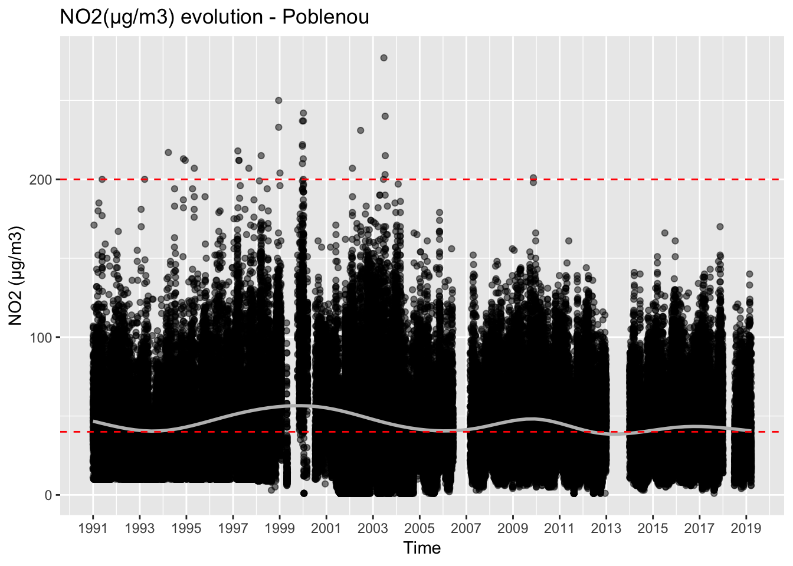

We can observe that in Poblenou there is data from 1991 to 2019, but there is no data for 2013.This is common to all stations.

Also, I have included two red dotted lines, indicating EU air quality standards for [NO2](http://ec.europa.eu/environment/air/quality/standards.htm):

- Hourly limit for NO2 of 200 µg/m3 (18 Permitted exceedences each year).
- Average yearly limit of 40 µg/m3.

In an initial look, it seems that all data are complying with the hourly limit of 200 µg/m3 in the recent years, but there are multiple values above the 200 µg/m3 mark in the initial years. It's positive, it seems like the pollution has improved since early 1990s. The average concentration of NO2 is right on the limit of 40 µg/m3. 

I am going to plot the data for Eixample:

```r
Eixample_NO2_plt <- ggplot(Eixample_NO2, aes(x = dt, y = value)) +
  geom_point(alpha = 0.5) +
  geom_hline(yintercept = 200, linetype="dashed", colour = "red")+
  geom_hline(yintercept = 40, linetype="dashed", colour = "red")+
  geom_smooth(color = "grey", alpha = 0.2) +
  scale_x_datetime(breaks='2 years',date_labels = "%Y") +
  labs( x = "Year", y = "NO2 (µg/m3)", title = "NO2(µg/m3) - NO2 evolution in Eixample station")
Eixample_NO2_plt
```

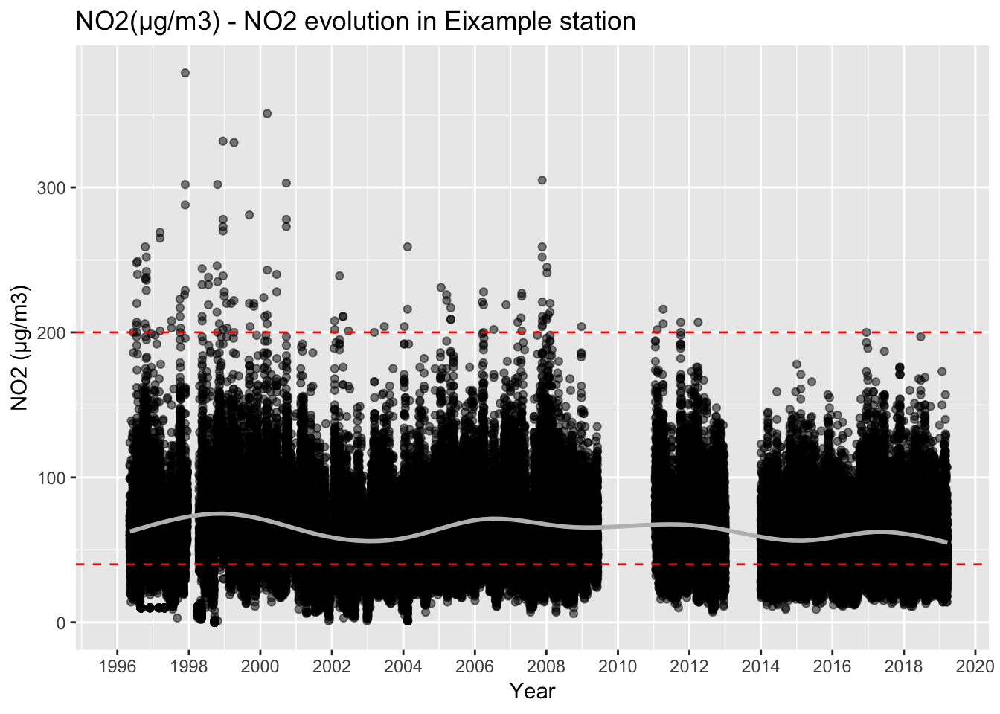
For Eixample we have data from 1996 to 2019, but there is no data from 2009 to 2011, and for 2013. There are multiple values above the 200 µg/m3 mark between 1996 and 2012, but then the pollution peaks improve from 2014 to 2019. This is positive news. But the average curve is above the yearly average quality standard.  

Now I want to see the data more closely, so I will repeat the plot for Eixample but subsetting the data to just a week:
I will define Start and end times for the subset as POSICXct objects:

```r
startTime <- as.POSIXct("2019-03-01 10:00:00",tz="UTC")
endTime <- as.POSIXct("2019-03-8 10:00:00",tz="UTC")
```
I will create a start and end time R object:

```r
start.end <- c(startTime,endTime)
start.end
```

```
## [1] "2019-03-01 10:00:00 UTC" "2019-03-08 10:00:00 UTC"
```

I have to format with time zone as otherwise ggplot2 doesnt deal with original date format

```r
date_format_tz <- function(format = "%Y-%m-%d", tz = "UTC") {
  function(x) format(x, format, tz=tz)
}
```

I am now going to plot just for Eixample:

```r
Eixample_NO2_subset_plt <- ggplot(Eixample_NO2, aes(x = as.POSIXct(dt), y = value)) +
  geom_line(alpha = 0.5) +
  geom_hline(yintercept = 40, linetype="dashed", colour = "red")+
  labs( x = "Time", y = "NO2 (µg/m3)", title = "NO2(µg/m3) - NO2 levels in March 2019 in Eixample")+
  geom_smooth(color = "grey", alpha = 0.2) +
  coord_cartesian( ylim = c(0, 150))+
  scale_x_datetime(limits=start.end,breaks='24 hours',labels = date_format_tz( "%b\n%d"))

Eixample_NO2_subset_plt
```

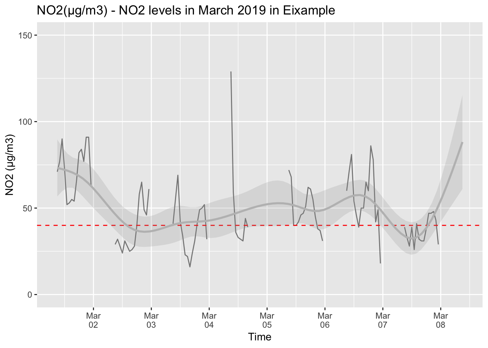

This is a big finding, as I observe that there are no measurements taken between 1am and 10am systematically in any station, avoiding rush hour in the morning. This is bad news as we are not measuring the morning pollution peak due to morning rush hour.

This also means that I'll have big number of not assigned values, difficulting a good forecasting model.

I have done similar cleansing and analysis for pollutant PM10 data. Please check the code in this R script in [PM10 R_PM10_first_analysis.R](insert link).

After seeing the plots for PM10 for each and all stations, I have observed that there are two stations that are not capturing PM10 at all, which are Ciutatella and Vall Hebron, and other stations in which PM10 has been capturing on and off. 

Also similarly to NO2, the PM10 data has been only measured during the day between 10am and midnight 12am, missing all values between 1am and 10am (9 observations).

### Missing values management - package imputeTS

In order to deal with the NA values I will use the imputeTS library, which deals with missing values in univariate time series using multiple imputation algorithms like 'Mean', 'LOCF', 'Interpolation', 'Moving Average', 'Seasonal Decomposition', 'Kalman Smoothing on Structural Time Series models', 'Kalman Smoothing on ARIMA models'. It also provides useful tools to visualize and understand the NA-s distribution. 

I am going to create a TS object with assumption frequency= 24 (hourly measurements with 1 day seasonality).
First I will try just a month, 20014 January, to test and see the results:


```r
Poblenou_NO2_2014_1 <- Poblenou_NO2 %>% filter(year ==2014 & month == 1)
Poblenou_NO2_2014_ts_1 <- ts(Poblenou_NO2_2014_1[,11], start = c(2014, 1), frequency = 24)
```
Now I will analyze the NA-s with a distribution bar plot:

```r
plotNA.distributionBar(Poblenou_NO2_2014_ts_1, breaks = 31)
```

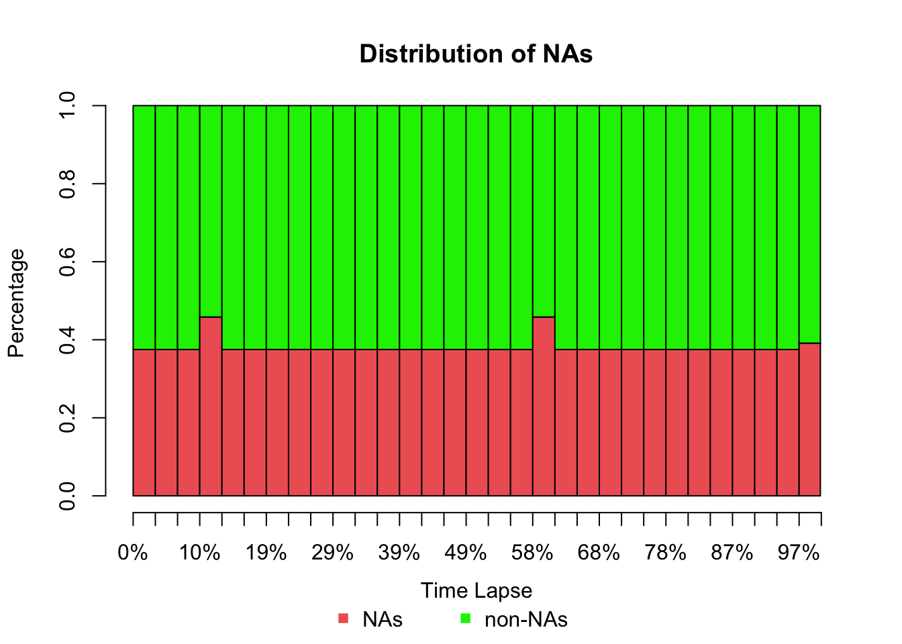
Gapsize tells the distribution of the gapsizes in a time series:

```r
plotNA.gapsize(Poblenou_NO2_2014_ts_1)
```

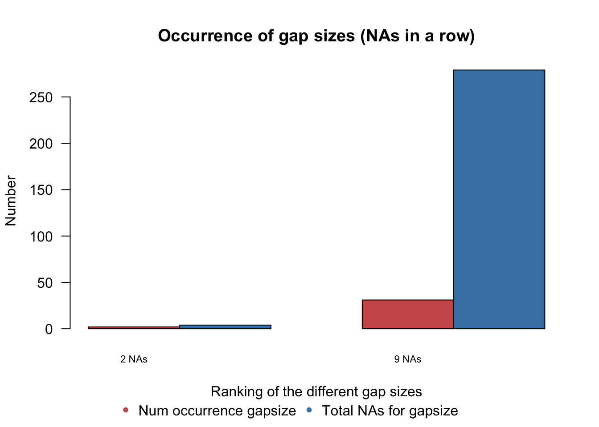

We can also see some stats about the NA-s. 


```r
statsNA(Poblenou_NO2_2014_ts_1)
```

```
## [1] "Length of time series:"
## [1] 744
## [1] "-------------------------"
## [1] "Number of Missing Values:"
## [1] 283
## [1] "-------------------------"
## [1] "Percentage of Missing Values:"
## [1] "38%"
## [1] "-------------------------"
## [1] "Stats for Bins"
## [1] "  Bin 1 (186 values from 1 to 186) :      68 NAs (36.6%)"
## [1] "  Bin 2 (186 values from 187 to 372) :      69 NAs (37.1%)"
## [1] "  Bin 3 (186 values from 373 to 558) :      74 NAs (39.8%)"
## [1] "  Bin 4 (186 values from 559 to 744) :      72 NAs (38.7%)"
## [1] "-------------------------"
## [1] "Longest NA gap (series of consecutive NAs)"
## [1] "9 in a row"
## [1] "-------------------------"
## [1] "Most frequent gap size (series of consecutive NA series)"
## [1] "9 NA in a row (occuring 31 times)"
## [1] "-------------------------"
## [1] "Gap size accounting for most NAs"
## [1] "9 NA in a row (occuring 31 times, making up for overall 279 NAs)"
## [1] "-------------------------"
## [1] "Overview NA series"
## [1] "  2 NA in a row: 2 times"
## [1] "  9 NA in a row: 31 times"
```
We observe that the NA gap that repeats more is the gap of size 9, which are the gaps related to the absence of meditions from midnight to 10am.

Not having data to test makes it difficult to choose a particular algorithm versus another, but I will try some and see how they look.

I will impute NA values by values by mean algorithm:

```r
imp_2014_1_NO2_Poblenou_mean <- na.mean(Poblenou_NO2_2014_ts_1)
```
Plot of data with NA-s vs data with imputations with mean values:

```r
plotNA.imputations(x.withNA = Poblenou_NO2_2014_ts_1, x.withImputations = imp_2014_1_NO2_Poblenou_mean)
```

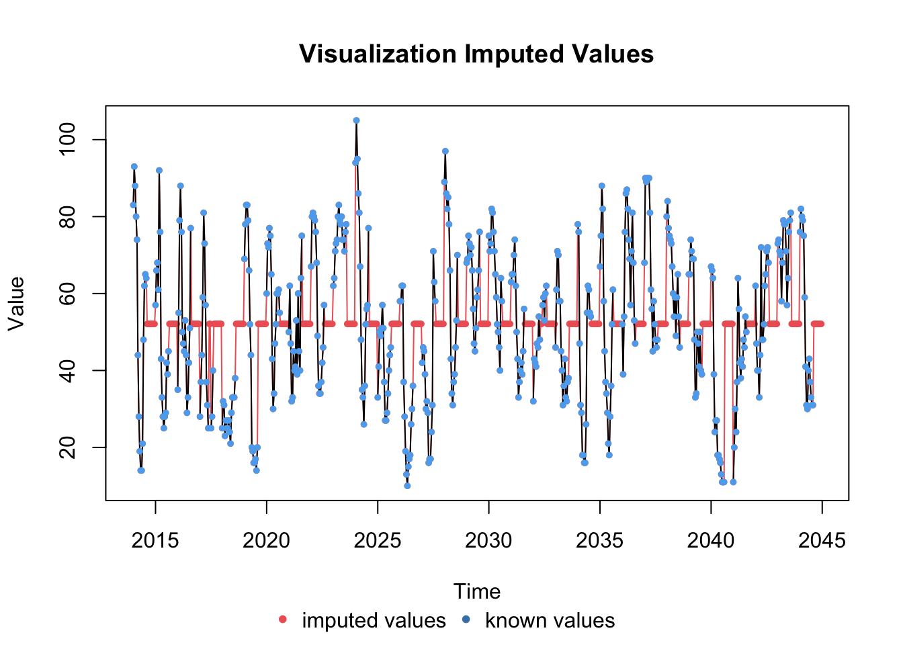

I will impute NA values by Weighted Moving Average algorithm:

```r
imp_2014_1_NO2_Poblenou_ma <- na.ma(Poblenou_NO2_2014_ts_1)
```

Plot of data with NA-s vs data with imputations with Weighted Moving Average values:

```r
plotNA.imputations(x.withNA = Poblenou_NO2_2014_ts_1, x.withImputations = imp_2014_1_NO2_Poblenou_ma)
```

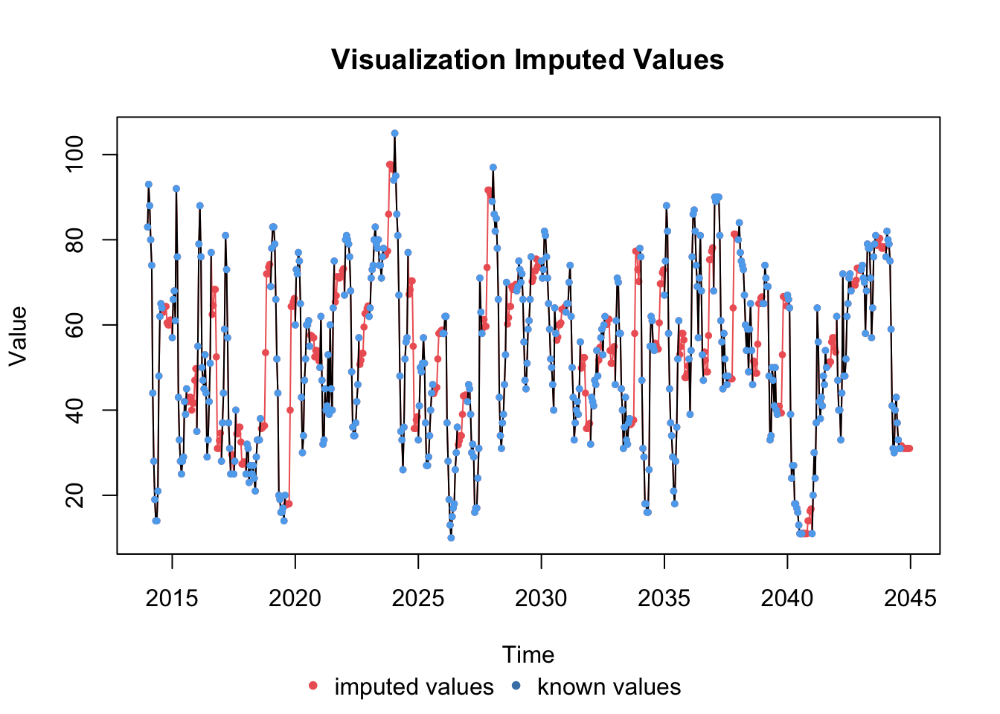

I will impute NA values by Last Observation Carried Forward algorithm:

```r
imp_2014_1_NO2_Poblenou_locf <- na.locf(Poblenou_NO2_2014_ts_1)
```

Plot of data with NA-s vs data with imputations by Last Observation Carried Forward algorithm:

```r
plotNA.imputations(x.withNA = Poblenou_NO2_2014_ts_1, x.withImputations = imp_2014_1_NO2_Poblenou_locf)
```

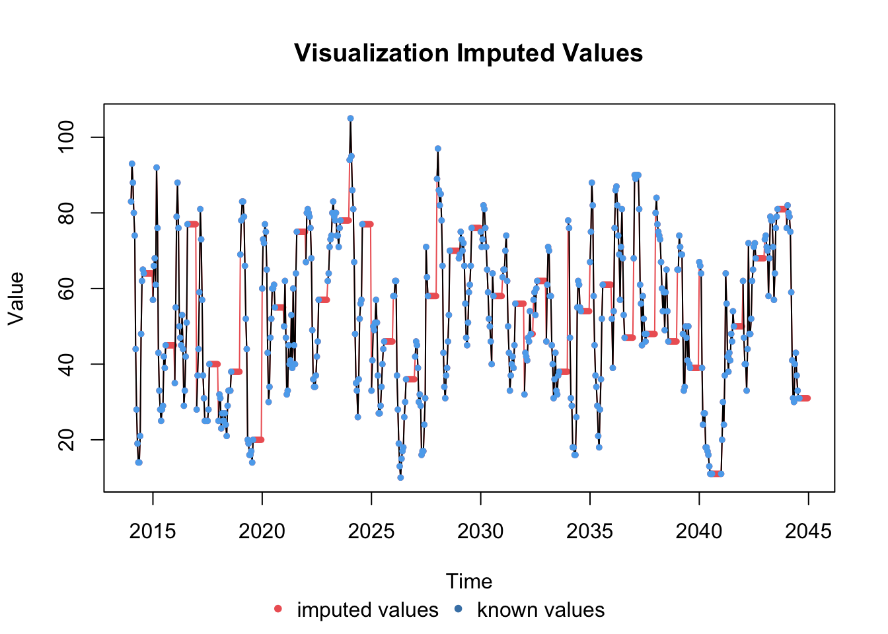

I will impute NA values by kalman algorithm:

```r
imp_2014_1_NO2_Poblenou_kalman <- na.kalman(Poblenou_NO2_2014_ts_1)
```

Plot of data with NA-s vs data with imputations with kalman algorithm:

```r
plotNA.imputations(x.withNA = Poblenou_NO2_2014_ts_1, x.withImputations = imp_2014_1_NO2_Poblenou_kalman)
```

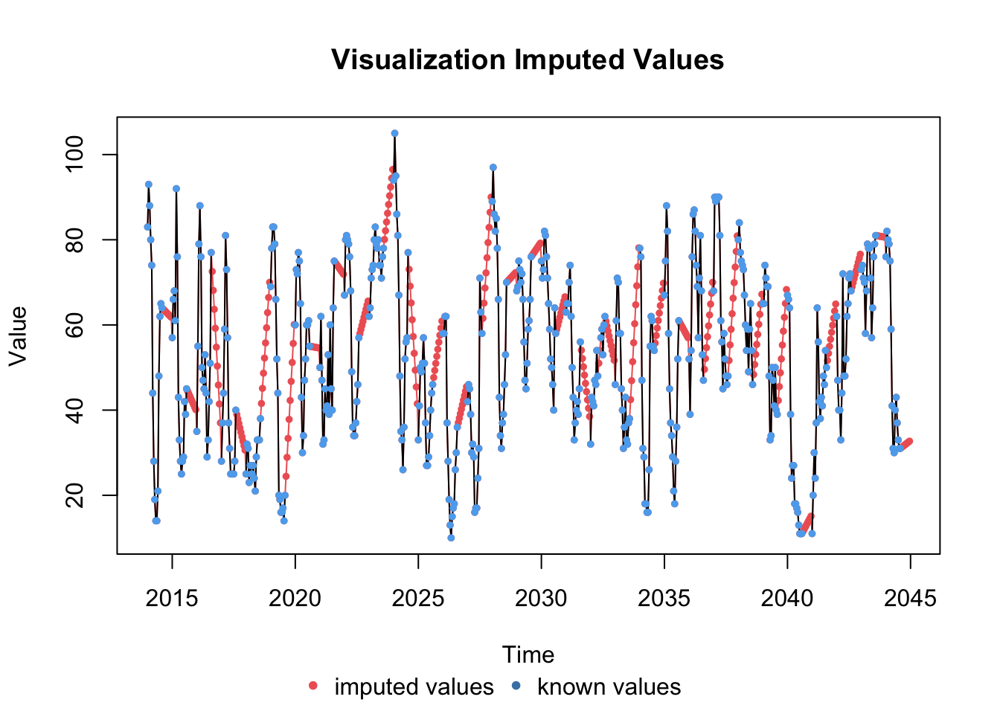
Some imputed values are negative, which is not a good outcome, so I will discard this method.

I will impute NA values by interpolation algorithm:

```r
imp_2014_1_NO2_Poblenou_intp <- na.interpolation(Poblenou_NO2_2014_ts_1)
```

Plot of data with NA-s vs data with imputations with interpolation algorithm:

```r
plotNA.imputations(x.withNA = Poblenou_NO2_2014_ts_1, x.withImputations = imp_2014_1_NO2_Poblenou_intp)
```

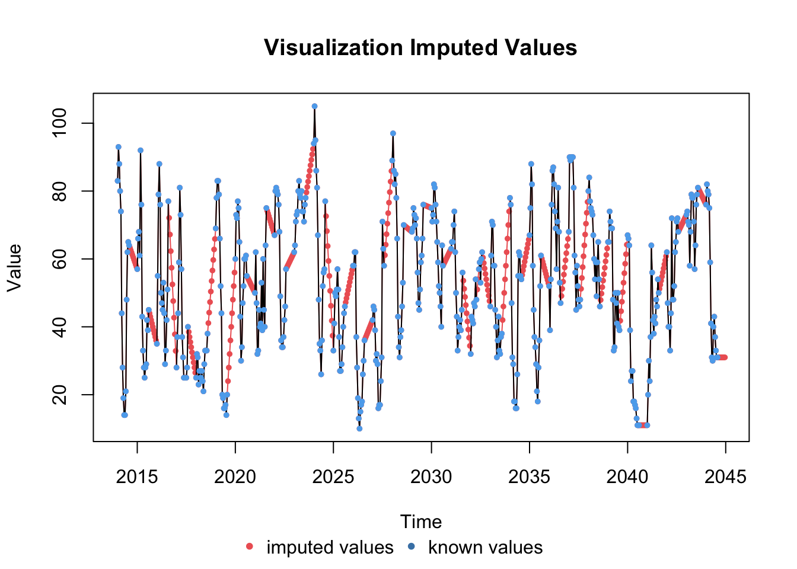

I am going to choose interpolation algorithm to impute values to the data that I will use for forecasting purposes and the exploration analysis. 

# Data exploration

I want to know more about the pollution in Barcelona and so in this chapter I will try to get more insights, and see what I discover from the data.  There are multiple questions I'm curious about and I am going to try find answers by using some additional datasets like weather, health and calendar dates. 
You can find the R script in [here](https://github.com/Ionetxu/Project_AIR/blob/master/Data_Exploration.R)

## General exploration
Let's start by loading the data for NO2 and PM10 pollutants in Eixample from 2014 to 2018. 
Please load files "Eixample_NO2_2014_2018.csv" and "Eixample_PM10.csv". 

```r
library(readr)
library(dplyr)
library(tidyr)
library(purrr)
library(lubridate)
library(ggplot2)
library(stringr)
library(knitr)
library(xts)
library(zoo)
library(gridExtra)
library(fpp2)
library(RcppRoll)
library(kableExtra)
library(imputeTS)
library(ggfortify)
library(urca)
library(forecast)
library(hydroTSM)
library(tidyquant)
library(reshape)
library(ggpubr)
library(openair)
library(data.table)
require('data.table')
library(robust)
library(corrplot)
Eixample_NO2 <- read_csv('/Users/ione/Desktop/Project_AIR/data/Eixample_NO2_2014_2018.csv')
Eixample_PM10 <- read_csv('/Users/ione/Desktop/Project_AIR/data/Eixample_PM10.csv')
```

I will rename columns for NO2 and PM10.

```r
Eixample_NO2 <- Eixample_NO2 %>% dplyr::rename(NO2='imp_2014_2018_NO2_Eixample_intp')
Eixample_PM10 <- Eixample_PM10 %>% dplyr::rename(PM10='imp_2014_2018_PM10_Eixample_intp')
```

I am going to calculate the daily value for the average, median, min and max of both pollutants NO2 and PM10 in Eixample from 2014 to 2018.

```r
stat_fun <- function(x) c(min = min(x), max = max(x), mean = mean(x), median = median(x))
Eixample_NO2_day <- Eixample_NO2 %>%
  tq_transmute(select     = NO2,
               mutate_fun = apply.daily,
               FUN        = stat_fun)
summary(Eixample_NO2_day)
```

```
##        dt                           min              max        
##  Min.   :2014-01-01 23:00:00   Min.   :  9.00   Min.   : 25.00  
##  1st Qu.:2015-04-03 11:00:00   1st Qu.: 26.00   1st Qu.: 71.00  
##  Median :2016-07-02 23:00:00   Median : 34.00   Median : 86.00  
##  Mean   :2016-07-02 22:59:14   Mean   : 35.54   Mean   : 87.97  
##  3rd Qu.:2017-10-02 11:00:00   3rd Qu.: 43.00   3rd Qu.:102.00  
##  Max.   :2019-01-01 00:00:00   Max.   :127.00   Max.   :200.00  
##       mean            median      
##  Min.   : 18.27   Min.   : 17.60  
##  1st Qu.: 46.32   1st Qu.: 45.23  
##  Median : 58.58   Median : 57.50  
##  Mean   : 59.74   Mean   : 59.12  
##  3rd Qu.: 70.66   3rd Qu.: 70.30  
##  Max.   :129.75   Max.   :139.75
```


```r
Eixample_PM10_day <- Eixample_PM10 %>%
  tq_transmute(select     = PM10,
               mutate_fun = apply.daily,
               FUN        = stat_fun)
summary(Eixample_PM10_day)
```

```
##        dt                           min             max         
##  Min.   :2014-01-01 23:00:00   Min.   : 1.00   Min.   :  12.17  
##  1st Qu.:2015-04-03 11:00:00   1st Qu.:13.00   1st Qu.:  34.00  
##  Median :2016-07-02 23:00:00   Median :18.00   Median :  44.00  
##  Mean   :2016-07-02 22:59:14   Mean   :18.35   Mean   :  50.38  
##  3rd Qu.:2017-10-02 11:00:00   3rd Qu.:23.00   3rd Qu.:  57.00  
##  Max.   :2019-01-01 00:00:00   Max.   :77.16   Max.   :1167.00  
##       mean             median      
##  Min.   :  6.271   Min.   : 3.821  
##  1st Qu.: 22.896   1st Qu.:22.000  
##  Median : 28.854   Median :28.100  
##  Mean   : 30.921   Mean   :29.623  
##  3rd Qu.: 36.281   3rd Qu.:35.200  
##  Max.   :302.854   Max.   :99.509
```

Let's plot the daily average of NO2 in Eixample:

```r
ggplot(Eixample_NO2_day, aes(x = as.Date(dt), y = mean)) +
  geom_line(alpha = 0.5) +
  geom_smooth(color = "grey", alpha = 0.2) +
  scale_x_date(breaks='1 year') +
  labs( x = "Time", y = "NO2 (µg/m3)", title = " Eixample - NO2 (µg/m3) daily average")
```

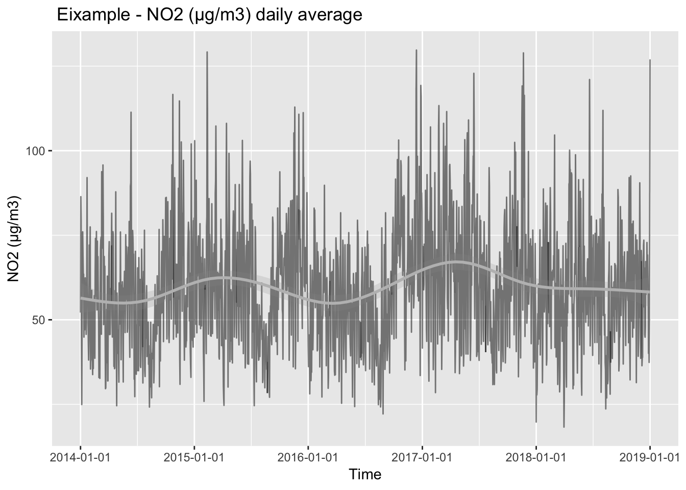

The trend is not negative, even slightly positive, which means the NO2 pollution has not improved in the last five years. Seasonality seems to be yearly.

Plot for daily average of PM10:

```r
ggplot(Eixample_PM10_day, aes(x = as.Date(dt), y = mean)) +
  geom_line(alpha = 0.5) +
  geom_smooth(color = "grey", alpha = 0.2) +
  scale_x_date(breaks='1 year') +
  labs( x = "Time", y = "PM10 (µg/m3)", title = "Eixample - PM10 (µg/m3) daily average")
```

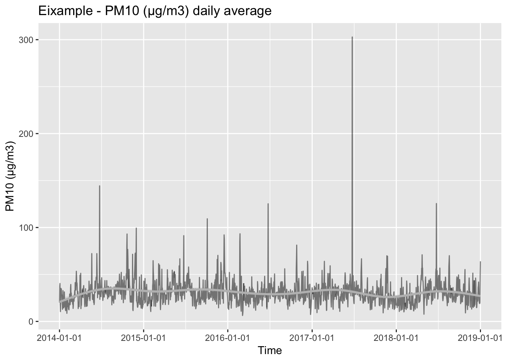

There are many outliers and I will look at them in a moment. 
The trend also seems to be quite flat, PM10 concentrations have not improved much in the last five years. 

Monthly median, average, max and minimum for both NO2 and PM10.

```r
Eixample_NO2_month <- Eixample_NO2 %>%
  tq_transmute(select     = NO2,
               mutate_fun = apply.monthly,
               FUN        = stat_fun)
summary(Eixample_NO2_month)
```

```
##        dt                           min              max       
##  Min.   :2014-01-31 23:00:00   Min.   :  9.00   Min.   :104.0  
##  1st Qu.:2015-04-30 23:00:00   1st Qu.: 13.00   1st Qu.:125.0  
##  Median :2016-07-31 23:00:00   Median : 16.00   Median :136.0  
##  Mean   :2016-07-31 04:31:28   Mean   : 17.72   Mean   :140.1  
##  3rd Qu.:2017-10-31 23:00:00   3rd Qu.: 18.00   3rd Qu.:155.0  
##  Max.   :2019-01-01 00:00:00   Max.   :127.00   Max.   :200.0  
##       mean            median      
##  Min.   : 40.92   Min.   : 38.50  
##  1st Qu.: 54.50   1st Qu.: 52.30  
##  Median : 59.13   Median : 57.00  
##  Mean   : 60.83   Mean   : 58.57  
##  3rd Qu.: 65.76   3rd Qu.: 63.50  
##  Max.   :127.00   Max.   :127.00
```


```r
Eixample_PM10_month <- Eixample_PM10 %>%
  tq_transmute(select     = PM10,
               mutate_fun = apply.monthly,
               FUN        = stat_fun)
summary(Eixample_PM10_month)
```

```
##        dt                           min             max        
##  Min.   :2014-01-31 23:00:00   Min.   : 1.00   Min.   :  51.0  
##  1st Qu.:2015-04-30 23:00:00   1st Qu.: 4.00   1st Qu.:  79.0  
##  Median :2016-07-31 23:00:00   Median : 6.00   Median :  98.0  
##  Mean   :2016-07-31 04:31:28   Mean   : 7.41   Mean   : 151.4  
##  3rd Qu.:2017-10-31 23:00:00   3rd Qu.: 9.00   3rd Qu.: 127.0  
##  Max.   :2019-01-01 00:00:00   Max.   :64.00   Max.   :1167.0  
##       mean           median     
##  Min.   :20.13   Min.   :18.70  
##  1st Qu.:27.43   1st Qu.:25.00  
##  Median :30.80   Median :28.00  
##  Mean   :31.44   Mean   :28.59  
##  3rd Qu.:33.96   3rd Qu.:30.90  
##  Max.   :64.00   Max.   :64.00
```

I will plot the monthly values.

```r
ggplot( data =Eixample_NO2_month , aes(x = as.Date(dt), y = mean)) +
  geom_line(alpha = 0.5) +
  labs( x = "Time", y = "NO2 (µg/m3)", title = "NO2(µg/m3) - Eixample NO2 monthly avg")+
  geom_smooth(color = "grey", alpha = 0.2) +
  scale_x_date(breaks='6 months', date_labels = "%m-%Y")
```

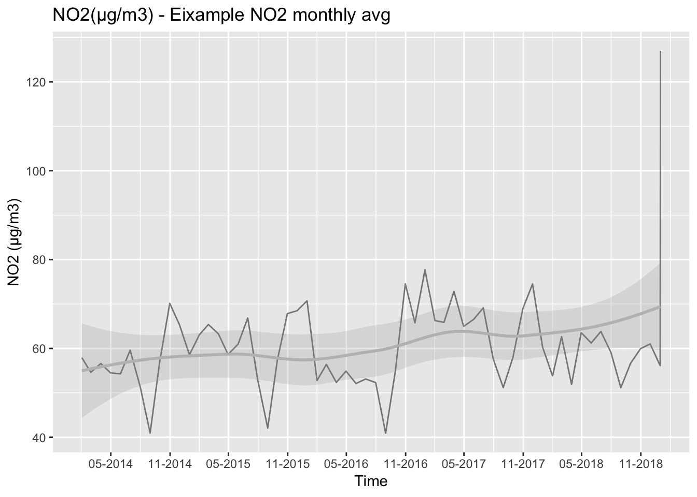

I see yearly seasonality and positive trend for NO2. 


```r
ggplot(data =Eixample_PM10_month ,aes(x = as.Date(dt), y = mean)) +
  geom_line(alpha = 0.5) +
  labs( x = "Time", y = "PM10 (µg/m3)", title = "Eixample PM10 monthly avg")+
  geom_smooth(color = "grey", alpha = 0.2) +
  scale_x_date(breaks='6 months', date_labels = "%m-%Y")
```

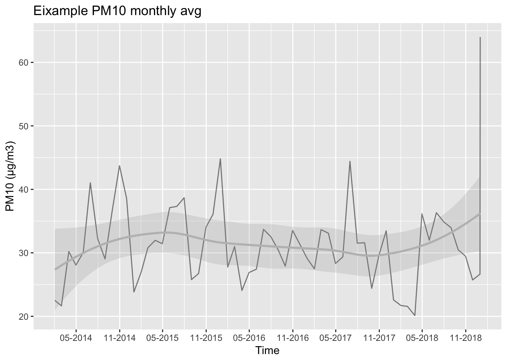

For PM10 the seasonality is not that evident, and there is not a clear trend neither. 

Yearly mean, median, min and max for both PM10 and NO2.

```r
Eixample_NO2_year <- Eixample_NO2 %>%
  tq_transmute(select     = NO2,
               mutate_fun = apply.yearly,
               FUN        = stat_fun)
head(Eixample_NO2_year,5)
```

```
## # A tibble: 5 x 5
##   dt                    min   max  mean median
##   <dttm>              <dbl> <dbl> <dbl>  <dbl>
## 1 2014-12-31 23:00:00     9   159  56.8   54  
## 2 2015-12-31 23:00:00     9   178  61.4   58.5
## 3 2016-12-31 23:00:00    11   200  57.3   55  
## 4 2017-12-31 23:00:00    13   187  64.6   61.3
## 5 2018-12-31 23:00:00    11   197  58.3   56
```

We can now see if NO2 is complying with EU air quality regulations:

- Hourly limit for NO2 of 200 µg/m3 (18 Permitted exceedences each year).
- Average yearly limit of 40 µg/m3.

There is only one time that NO2 reching 200 µg/m3, so NO2 levels in Barcelona are complying with hourly limit.  
But the average yearly limit of 40 µg/m3 has not been met in any year for the last five years, which is a violation of EU air quality regulations. 


```r
Eixample_PM10_year <- Eixample_PM10 %>%
  tq_transmute(select     = PM10,
               mutate_fun = apply.yearly,
               FUN        = stat_fun)
head(Eixample_PM10_year,5)
```

```
## # A tibble: 5 x 5
##   dt                    min   max  mean median
##   <dttm>              <dbl> <dbl> <dbl>  <dbl>
## 1 2014-12-31 23:00:00     4   471  31.5   28.6
## 2 2015-12-31 23:00:00     1   536  33.5   30  
## 3 2016-12-31 23:00:00     1   458  29.6   27  
## 4 2017-12-31 23:00:00     1  1167  30.7   28  
## 5 2018-12-31 23:00:00     1   431  29.1   26.4
```

For PM10, the EU air quality regulations state that:

- Daily concentration for PM10 of 50 µg/m3 (35 Permitted exceedences each year).
- Average yearly limit of 40 µg/m3.

PM10 average yearly limits are met every year, but I will check if the daily PM10 concentrations meet the EU air quality limits. 


```r
Eixample_PM10_day_2014 <- Eixample_PM10_day %>% filter( dt <= "2014-12-31")
Eixample_PM10_day_2015 <- Eixample_PM10_day %>% filter( dt >= "2015-01-01" & dt <= "2015-12-31")
Eixample_PM10_day_2016 <- Eixample_PM10_day %>% filter( dt >= "2016-01-01" & dt <= "2016-12-31")
Eixample_PM10_day_2017 <- Eixample_PM10_day %>% filter( dt >= "2017-01-01" & dt <= "2017-12-31")
Eixample_PM10_day_2018 <- Eixample_PM10_day %>% filter( dt >= "2018-01-01" & dt <= "2018-12-31")

Eixample_PM10_day_2014 %>% summarize(n_cases = sum(Eixample_PM10_day_2014$mean >= 50))
```

```
## # A tibble: 1 x 1
##   n_cases
##     <int>
## 1      22
```

```r
Eixample_PM10_day_2015 %>% summarize(n_cases = sum(Eixample_PM10_day_2015$mean >= 50))
```

```
## # A tibble: 1 x 1
##   n_cases
##     <int>
## 1      33
```

```r
Eixample_PM10_day_2016 %>% summarize(n_cases = sum(Eixample_PM10_day_2016$mean >= 50))
```

```
## # A tibble: 1 x 1
##   n_cases
##     <int>
## 1      16
```

```r
Eixample_PM10_day_2017 %>% summarize(n_cases = sum(Eixample_PM10_day_2017$mean >= 50))
```

```
## # A tibble: 1 x 1
##   n_cases
##     <int>
## 1      20
```

```r
Eixample_PM10_day_2018 %>% summarize(n_cases = sum(Eixample_PM10_day_2018$mean >= 50))
```

```
## # A tibble: 1 x 1
##   n_cases
##     <int>
## 1      16
```

There is no year with more than 35 cases with concentrations of PM10 higher than 50 µg/m3. Year 2015 had 33 cases but it's still complying the regulations.

I am now going to analyze the outliers with extremely high PM10 values. 

```r
outliers <- Eixample_PM10_day[order(Eixample_PM10_day$max, decreasing = TRUE),]
outliers
```

```
## # A tibble: 1,827 x 5
##    dt                    min   max  mean median
##    <dttm>              <dbl> <dbl> <dbl>  <dbl>
##  1 2017-06-24 23:00:00    20  1167 303.    54  
##  2 2015-06-07 23:00:00    21   536  66.7   27  
##  3 2015-10-03 23:00:00     1   509  60.5   28.2
##  4 2014-06-24 23:00:00     9   471 144.    56  
##  5 2016-06-24 23:00:00    15   458 125.    43  
##  6 2018-06-24 23:00:00    18   431 126.    41  
##  7 2015-10-04 23:00:00    14   405 109.    28  
##  8 2015-06-24 23:00:00    19   314  91.3   37  
##  9 2018-06-23 23:00:00    13   312  43.1   25.8
## 10 2014-11-30 23:00:00     8   269  99.4   86.4
## # … with 1,817 more rows
```

If we see the list of the maximum values, on the 24th of June, 2017 the maximum concentration measured was of 1167 µg/m3, when the legal limit daily concentration of PM10 is 50 µg/m3. 
But positions 4,5,6,and 8, are also on the 24th June, which is the day of [Sant Joan](http://lameva.barcelona.cat/culturapopular/en/festivals-and-traditions/nit-de-sant-joan). 

Sant Joan is often described by Catalans as the 'Nit del Foc' - meaning the 'Night of Fire'. The main aspect to the celebrations is fireworks, bonfires and firecrackers. Fireworks cause extensive air pollution in a short amount of time, leaving metal particles, dangerous toxins, harmful chemicals and smoke in the air for hours and days.

Doing some research on this, I have surprisingly found out that fireworks have been banned in China  for Lunar New Year [celebrations](https://www.youtube.com/watch?v=PMUla2mnz_E) to avoid higher pollution. 
Also in India, firecrackers have been partially banned for Diwali hindu [celebrations](https://www.youtube.com/watch?v=d8lZtiXbonI).

Second highest value in the list, corresponds to 7th June 2015. This is when Barcelona FC won its 5th Champions League final, and celebrations surely included fireworks and firecrackers. 

## Weather and pollution
What is the relationship between weather and pollutants NO2 and PM10? How are pollutants affected by different weather components? Let's try to answer these questions.

Let's load the data from Raval- zoo in Barcelona (EMA = X4). I'm going to use the weather data from
Raval to compare it with pollution measured in Eixample due to proximity between both stations.
Please load file "Jlerchundi_X4_14-19.csv". 

```r
Weather_bcn <- read_csv('/Users/ione/Desktop/Project_AIR/data/Jlerchundi_X4_14-19.csv')
```

Data column is in format "1/1/2014 1:00", and it's a character, so I'll change it to be same as dt in the pollution datasets and be able to join the data.


```r
Weather_bcn <- Weather_bcn %>% dplyr::rename(dt="DATA (T.U.)",
                                             wd = "DV10",
                                             ws = "VV10")

Weather_bcn$dt <- parse_date_time(Weather_bcn$dt, "dmy HM", truncated = 3)
head(Weather_bcn)
```

```
## # A tibble: 6 x 12
##   EMA   dt                      T    Tx    Tn    HR   PPT     P    ws    wd
##   <chr> <dttm>              <dbl> <dbl> <dbl> <dbl> <dbl> <dbl> <dbl> <dbl>
## 1 X4    2014-01-01 00:00:00  10.1  10.9   9.6    56     0 1013.   2.8   324
## 2 X4    2014-01-01 01:00:00   9.8  10     9.7    58     0 1013.   4.1   316
## 3 X4    2014-01-01 02:00:00   9.9  10.1   9.6    58     0 1014.   3.4   301
## 4 X4    2014-01-01 03:00:00   9.4  10     8.3    60     0 1013.   1.8    58
## 5 X4    2014-01-01 04:00:00   8.4   8.9   7.9    65     0 1013.   1.2   333
## 6 X4    2014-01-01 05:00:00   8.7   9     8.2    65     0 1013.   1.1    21
## # … with 2 more variables: VVx10 <dbl>, DVVx10 <dbl>
```

Now I will do the join between the weather and pollution data:


```r
Eixample_NO2_weather <- merge(Eixample_NO2,Weather_bcn,by="dt" )
summary(Eixample_NO2_weather)
```

```
##        dt                       pollutant          station_code
##  Min.   :2014-01-01 01:00:00   Length:43848       Min.   :43   
##  1st Qu.:2015-04-02 18:45:00   Class :character   1st Qu.:43   
##  Median :2016-07-02 12:30:00   Mode  :character   Median :43   
##  Mean   :2016-07-02 07:41:31                      Mean   :43   
##  3rd Qu.:2017-10-02 06:15:00                      3rd Qu.:43   
##  Max.   :2019-01-01 00:00:00                      Max.   :43   
##                                                                
##     latitude       longitude         unit                year     
##  Min.   :41.39   Min.   :2.154   Length:43848       Min.   :2014  
##  1st Qu.:41.39   1st Qu.:2.154   Class :character   1st Qu.:2015  
##  Median :41.39   Median :2.154   Mode  :character   Median :2016  
##  Mean   :41.39   Mean   :2.154                      Mean   :2016  
##  3rd Qu.:41.39   3rd Qu.:2.154                      3rd Qu.:2017  
##  Max.   :41.39   Max.   :2.154                      Max.   :2018  
##                                                                   
##      month             day            value       station_alias     
##  Min.   : 1.000   Min.   : 1.00   Min.   :  9.0   Length:43848      
##  1st Qu.: 4.000   1st Qu.: 8.00   1st Qu.: 42.0   Class :character  
##  Median : 7.000   Median :16.00   Median : 57.0   Mode  :character  
##  Mean   : 6.527   Mean   :15.74   Mean   : 59.2                     
##  3rd Qu.:10.000   3rd Qu.:23.00   3rd Qu.: 74.0                     
##  Max.   :12.000   Max.   :31.00   Max.   :200.0                     
##                                   NA's   :17099                     
##       NO2            EMA                  T               Tx       
##  Min.   :  9.0   Length:43848       Min.   : 1.10   Min.   : 1.10  
##  1st Qu.: 42.5   Class :character   1st Qu.:13.40   1st Qu.:13.70  
##  Median : 57.0   Mode  :character   Median :17.80   Median :18.00  
##  Mean   : 59.7                      Mean   :18.19   Mean   :18.46  
##  3rd Qu.: 73.8                      3rd Qu.:23.10   3rd Qu.:23.40  
##  Max.   :200.0                      Max.   :35.70   Max.   :36.90  
##                                                                    
##        Tn              HR             PPT                 P         
##  Min.   : 1.00   Min.   :  6.0   Min.   : 0.00000   Min.   : 981.3  
##  1st Qu.:13.20   1st Qu.: 54.0   1st Qu.: 0.00000   1st Qu.:1009.0  
##  Median :17.50   Median : 65.0   Median : 0.00000   Median :1012.8  
##  Mean   :17.93   Mean   : 63.7   Mean   : 0.03472   Mean   :1012.7  
##  3rd Qu.:22.90   3rd Qu.: 74.0   3rd Qu.: 0.00000   3rd Qu.:1016.4  
##  Max.   :35.20   Max.   :100.0   Max.   :58.70000   Max.   :1036.2  
##                                                                     
##        ws               wd            VVx10            DVVx10     
##  Min.   : 0.000   Min.   :  0.0   Min.   : 0.000   Min.   :  0.0  
##  1st Qu.: 1.100   1st Qu.: 96.0   1st Qu.: 2.600   1st Qu.: 94.0  
##  Median : 1.800   Median :205.0   Median : 4.000   Median :207.0  
##  Mean   : 2.021   Mean   :186.7   Mean   : 4.478   Mean   :189.5  
##  3rd Qu.: 2.700   3rd Qu.:264.0   3rd Qu.: 5.800   3rd Qu.:270.0  
##  Max.   :10.400   Max.   :359.0   Max.   :20.900   Max.   :359.0  
##  NA's   :21       NA's   :22      NA's   :22       NA's   :22
```


```r
Eixample_PM10_weather <- merge(Eixample_PM10,Weather_bcn,by="dt" )
summary(Eixample_PM10_weather)
```

```
##        dt                       pollutant          station_code
##  Min.   :2014-01-01 01:00:00   Length:43848       Min.   :43   
##  1st Qu.:2015-04-02 18:45:00   Class :character   1st Qu.:43   
##  Median :2016-07-02 12:30:00   Mode  :character   Median :43   
##  Mean   :2016-07-02 07:41:31                      Mean   :43   
##  3rd Qu.:2017-10-02 06:15:00                      3rd Qu.:43   
##  Max.   :2019-01-01 00:00:00                      Max.   :43   
##                                                                
##     latitude       longitude         unit                year     
##  Min.   :41.39   Min.   :2.154   Length:43848       Min.   :2014  
##  1st Qu.:41.39   1st Qu.:2.154   Class :character   1st Qu.:2015  
##  Median :41.39   Median :2.154   Mode  :character   Median :2016  
##  Mean   :41.39   Mean   :2.154                      Mean   :2016  
##  3rd Qu.:41.39   3rd Qu.:2.154                      3rd Qu.:2017  
##  Max.   :41.39   Max.   :2.154                      Max.   :2018  
##                                                                   
##      month             day            value         station_alias     
##  Min.   : 1.000   Min.   : 1.00   Min.   :   1.00   Length:43848      
##  1st Qu.: 4.000   1st Qu.: 8.00   1st Qu.:  21.00   Class :character  
##  Median : 7.000   Median :16.00   Median :  28.00   Mode  :character  
##  Mean   : 6.527   Mean   :15.74   Mean   :  30.67                     
##  3rd Qu.:10.000   3rd Qu.:23.00   3rd Qu.:  37.00                     
##  Max.   :12.000   Max.   :31.00   Max.   :1167.00                     
##                                   NA's   :17595                       
##       PM10            EMA                  T               Tx       
##  Min.   :   1.0   Length:43848       Min.   : 1.10   Min.   : 1.10  
##  1st Qu.:  21.0   Class :character   1st Qu.:13.40   1st Qu.:13.70  
##  Median :  28.0   Mode  :character   Median :17.80   Median :18.00  
##  Mean   :  30.9                      Mean   :18.19   Mean   :18.46  
##  3rd Qu.:  37.0                      3rd Qu.:23.10   3rd Qu.:23.40  
##  Max.   :1167.0                      Max.   :35.70   Max.   :36.90  
##                                                                     
##        Tn              HR             PPT                 P         
##  Min.   : 1.00   Min.   :  6.0   Min.   : 0.00000   Min.   : 981.3  
##  1st Qu.:13.20   1st Qu.: 54.0   1st Qu.: 0.00000   1st Qu.:1009.0  
##  Median :17.50   Median : 65.0   Median : 0.00000   Median :1012.8  
##  Mean   :17.93   Mean   : 63.7   Mean   : 0.03472   Mean   :1012.7  
##  3rd Qu.:22.90   3rd Qu.: 74.0   3rd Qu.: 0.00000   3rd Qu.:1016.4  
##  Max.   :35.20   Max.   :100.0   Max.   :58.70000   Max.   :1036.2  
##                                                                     
##        ws               wd            VVx10            DVVx10     
##  Min.   : 0.000   Min.   :  0.0   Min.   : 0.000   Min.   :  0.0  
##  1st Qu.: 1.100   1st Qu.: 96.0   1st Qu.: 2.600   1st Qu.: 94.0  
##  Median : 1.800   Median :205.0   Median : 4.000   Median :207.0  
##  Mean   : 2.021   Mean   :186.7   Mean   : 4.478   Mean   :189.5  
##  3rd Qu.: 2.700   3rd Qu.:264.0   3rd Qu.: 5.800   3rd Qu.:270.0  
##  Max.   :10.400   Max.   :359.0   Max.   :20.900   Max.   :359.0  
##  NA's   :21       NA's   :22      NA's   :22       NA's   :22
```

In order to create a correlation matrix, I will only select the numeric variables.

```r
Eixample_NO2_weather_num_data <- Eixample_NO2_weather[, sapply(Eixample_NO2_weather, is.numeric)]
```

I will only choose the variables that are relevant for the correlation:

```r
Eixample_NO2_weather_cor <- dplyr::select(Eixample_NO2_weather_num_data, -c("station_code", "latitude", "longitude","year","month","day","value"))
```

I will see if we have NA values in the weather data, as I can't have any NA data to perform the correlation matrix.

```r
sum(is.na(Eixample_NO2_weather_cor))
```

```
## [1] 87
```

I have 87 values that are NA, so I will remove them from the analysis. 


```r
Eixample_NO2_weather_cor_NA <-Eixample_NO2_weather_cor[complete.cases(Eixample_NO2_weather_cor), ]
```

Now I will calculate the correlation matrix with only numeric values and no NA values.

```r
cormat_NO2 <- round(cor(Eixample_NO2_weather_cor_NA),2)
head(cormat_NO2)
```

```
##       NO2     T    Tx    Tn    HR   PPT     P    ws    wd VVx10 DVVx10
## NO2  1.00 -0.09 -0.09 -0.09  0.05  0.00  0.20 -0.31 -0.15 -0.32  -0.14
## T   -0.09  1.00  1.00  1.00 -0.03 -0.03 -0.06  0.15 -0.10  0.07  -0.11
## Tx  -0.09  1.00  1.00  1.00 -0.05 -0.03 -0.06  0.15 -0.10  0.08  -0.11
## Tn  -0.09  1.00  1.00  1.00 -0.02 -0.04 -0.06  0.14 -0.11  0.06  -0.11
## HR   0.05 -0.03 -0.05 -0.02  1.00  0.11 -0.05 -0.28 -0.29 -0.31  -0.28
## PPT  0.00 -0.03 -0.03 -0.04  0.11  1.00 -0.05  0.03 -0.02  0.07  -0.02
```

Looking at the data, NO2 values have a negative correlation coefficient of -0.31 with wind speed (ws), -0.15 with wind direction (wd), and positive 0.2 with atmospheric pressure (P). 

I will do the same with PM10 values:

```r
Eixample_PM10_weather_num_data <- Eixample_PM10_weather[, sapply(Eixample_PM10_weather, is.numeric)]
Eixample_PM10_weather_cor <- dplyr::select(Eixample_PM10_weather_num_data, -c("station_code", "latitude", "longitude","year","month","day","value"))

Eixample_PM10_weather_cor_NA <-Eixample_PM10_weather_cor[complete.cases(Eixample_PM10_weather_cor), ]
cormat_PM10 <- round(cor(Eixample_PM10_weather_cor_NA),2)
head(cormat_PM10)
```

```
##       PM10     T    Tx    Tn    HR   PPT     P    ws    wd VVx10 DVVx10
## PM10  1.00  0.19  0.19  0.18  0.05 -0.01  0.10 -0.08 -0.12 -0.10  -0.12
## T     0.19  1.00  1.00  1.00 -0.03 -0.03 -0.06  0.15 -0.10  0.07  -0.11
## Tx    0.19  1.00  1.00  1.00 -0.05 -0.03 -0.06  0.15 -0.10  0.08  -0.11
## Tn    0.18  1.00  1.00  1.00 -0.02 -0.04 -0.06  0.14 -0.11  0.06  -0.11
## HR    0.05 -0.03 -0.05 -0.02  1.00  0.11 -0.05 -0.28 -0.29 -0.31  -0.28
## PPT  -0.01 -0.03 -0.03 -0.04  0.11  1.00 -0.05  0.03 -0.02  0.07  -0.02
```

PM10 is most correlated with average temperature(T), with positive coefficient of 0.19, and then with atmospheric pressure (P) with correlation coefficient of 0.10. PM10 is also correlated with wind direction with negative coefficient -0.12.

The correlation matrix plot for relationship between NO2 and weather:

```r
corrplot(cormat_NO2, type="upper", order="hclust", tl.srt=45)
```

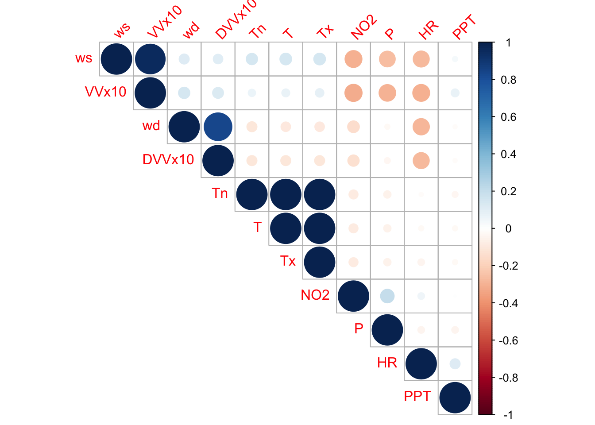

The correlation matrix plot for relationship between PM10 and weather:

```r
corrplot(cormat_PM10, type="upper",order="hclust", tl.srt=45)
```

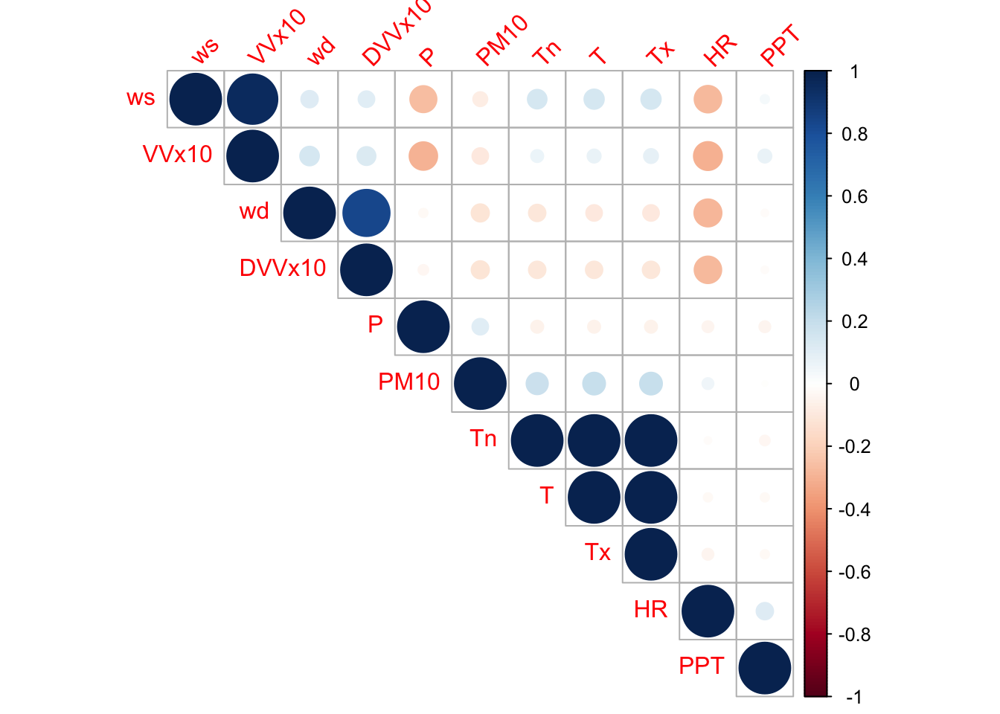

I will plot the most correlated variables, the NO2 pollution with Atmospheric pressure.

```r
ggscatter(Eixample_NO2_weather_cor_NA, x = "NO2", y = "P",
          add = "reg.line", conf.int = TRUE,
          cor.coef = TRUE, cor.method = "pearson", alpha = 0.1,
          xlab = "NO2 (µg/m3)", ylab = "Atmospheric pressure (hPa)", title = "NO2 vs P")
```

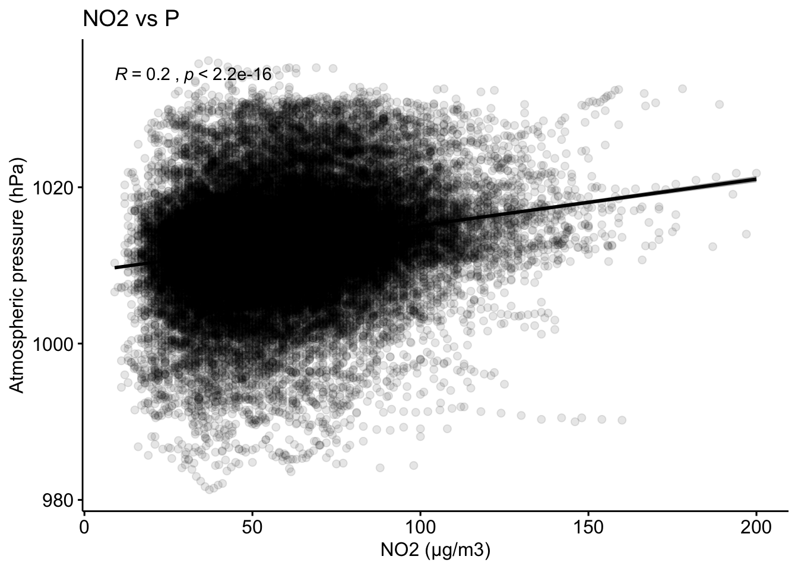

The higher the atmospheric pressure, the higher will be the NO2 concentration in the air. When there is anticyclone, winds are calmer therefore pollution is higher.

Let'a analyze the relationship between NO2 levels and Wind speed.

```r
ggscatter(Eixample_NO2_weather_cor_NA, x = "NO2", y = "ws",
          add = "reg.line", conf.int = TRUE,
          cor.coef = TRUE, cor.method = "pearson", alpha = 0.1,
          xlab = "NO2 (µg/m3)", ylab = "Wind speed (m/s)", title = "NO2 vs Wind speed")
```

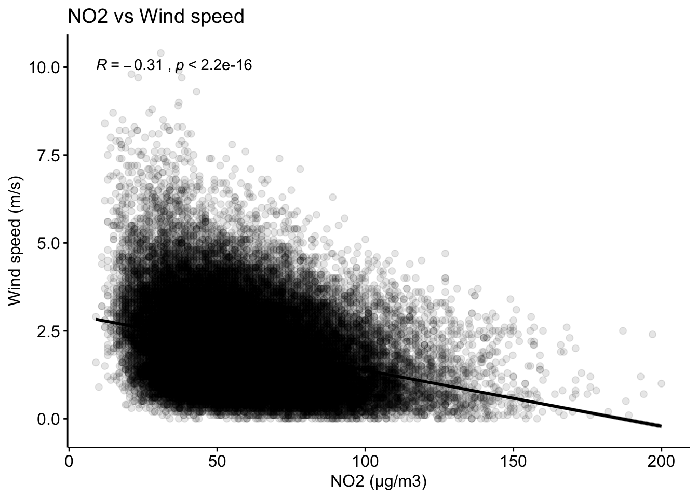

The NO2 concentrations decrease with higher wind speeds. 

For wind direction and NO2 relationship, I will use a windRose plot:


```r
windRose(Eixample_NO2_weather_cor_NA, ws = "ws", wd = "wd")
```


This plot tells us that the highest speed is normally NW direction winds, and 15% of the times the wind is SW. 

```r
percentileRose( mydata = Eixample_NO2_weather_cor_NA, wd = "wd", pollutant = "NO2", mean=TRUE, key.footer = "percentile")
```

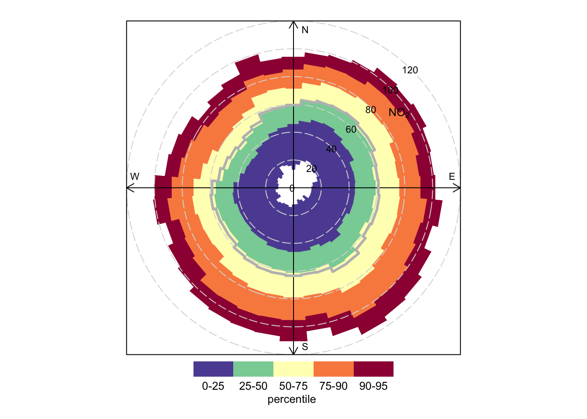

According to this graph, NO2 pollution is lowest when the wind is NW direction and higher speed. 
While when the wind is SE direction and low speed,the pollution is highest. 
This makes sense I understand this looking at the geography of the city, where the ocean sits south east of the city, and the pollution can scape that direction when the wind is NW. But when the wind is SE, the mountains hold the smog on top of the city.

I will do the same analysis for PM10. For PM10 the most influencing factor is Temperature.

```r
ggscatter(Eixample_PM10_weather_cor_NA, x = "PM10", y = "T",
          add = "reg.line", conf.int = TRUE,
          cor.coef = TRUE, cor.method = "pearson", alpha = 0.1,
          xlab = "PM10 (µg/m3)", ylab = "Temperature (°C)", title = "PM10 and T relationship in Eixample") +
          xlim(c(0,200)) #taking out outliers
```

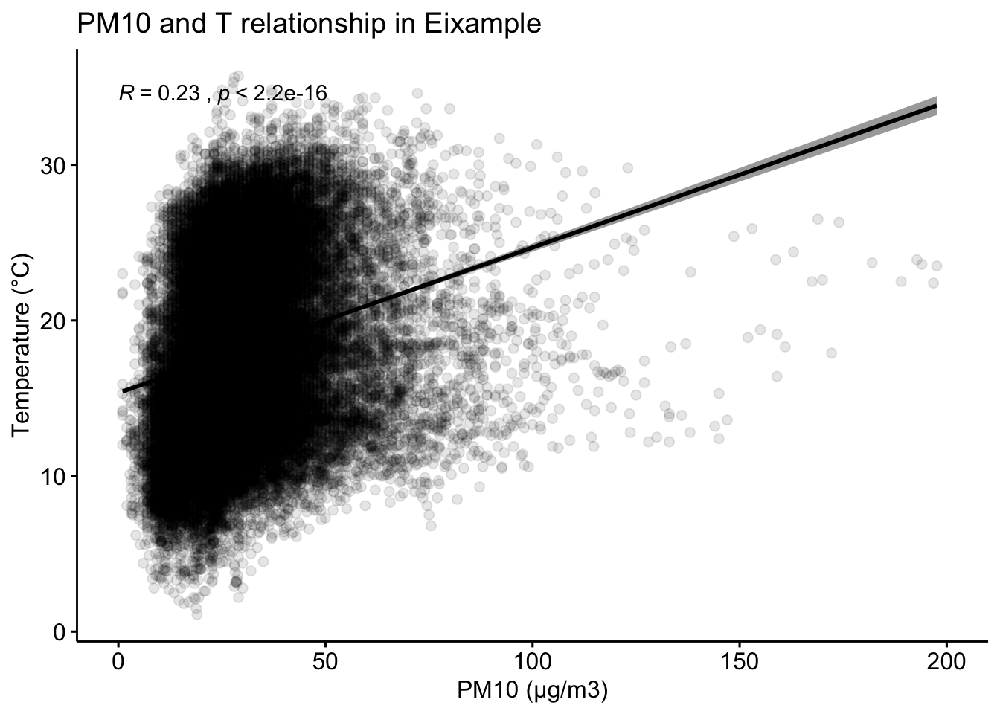


```r
ggscatter(Eixample_PM10_weather_cor_NA, x = "PM10", y = "P",
          add = "reg.line", conf.int = TRUE,
          cor.coef = TRUE, cor.method = "pearson", alpha = 0.1,
          xlab = "PM10 (µg/m3)", ylab = "Pressure (hPa)", title = "PM10 and P relationship in Eixample") +
  xlim(c(0,200)) #taking out outliers
```

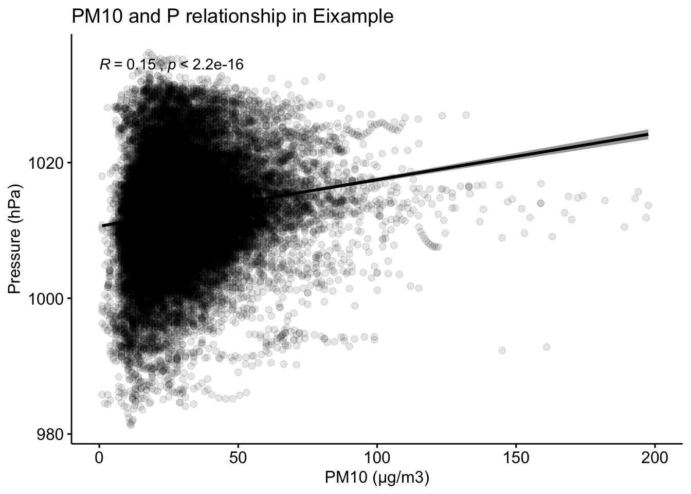

PM10 concentrations are higher with higher temperature and atmospheric pressure. 

Regarding wind direction and PM10:

```r
percentileRose( mydata = Eixample_PM10_weather_cor_NA, wd = "wd", pollutant = "PM10", mean=TRUE, key.footer = "percentile")
```

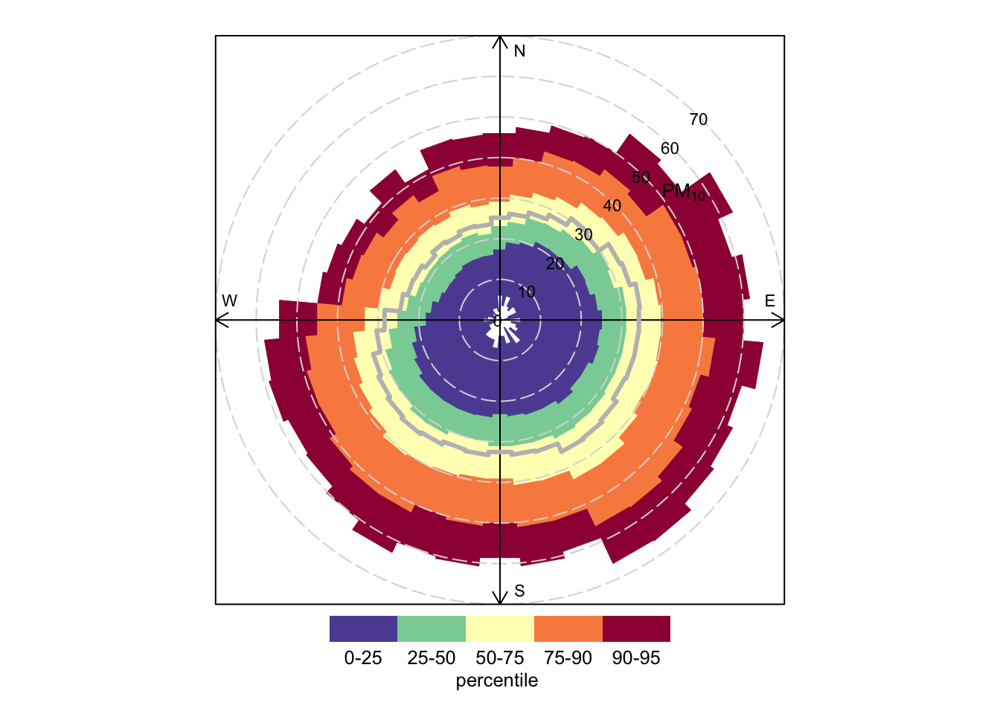

Very similar effect of the wind direction for NO2 and PM10. Pollution increases with SE wind direction and decreases with NW direction.

## Health and pollution
I will now try to see if there is any relationship between NO2 and PM10 concentrations and hospitalizations due to respiratory and cardiac issues. 
I will load the dataset of hospitalizations due to respiratory issues first. The data is aggregated by diagnosis and CIM-9 code,and they are daily values registered in Barcelona city. 
Please load file "Respiratory_2014-2017.csv".

```r
health_resp <- read_csv('/Users/ione/Desktop/Project_AIR/data/Respiratory_2014-2017.csv', locale = locale(encoding = "latin1"))
```

I will rename the column names:

```r
health_resp <- health_resp %>% dplyr::rename(day="dia",
                                             month= "mes",
                                             year= "any",
                                             Diagnosis = "Diagnòstic Principal",
                                             Hospitalizations = "Contactes d'hospitalització d'aguts (altes AH)")
head(health_resp)
```

```
## # A tibble: 6 x 6
##     day month  year Diagnosis                      `cim-9` Hospitalizations
##   <dbl> <chr> <dbl> <chr>                            <dbl>            <dbl>
## 1     1 Gener  2014 Nasofaringitis aguda [refreda…     460                1
## 2     1 Gener  2014 Amigdalitis aguda; NOS;fol·li…     463                1
## 3     1 Gener  2014 Pneumònia pneumocòccica [Estr…     481                1
## 4     1 Gener  2014 Pneumònia provocada per un mi…     486               14
## 5     2 Gener  2014 Abscés periamigdalí; abscés a…     475                1
## 6     2 Gener  2014 Pneumònia pneumocòccica [Estr…     481                3
```

Month names are strings in catalan and the system can't parse them into date format.
I will translate the month names and transform into date format:

```r
health_resp$month[health_resp$month == "Gener"] <- "January"
health_resp$month[health_resp$month == "Febrer"] <- "February"
health_resp$month[health_resp$month == "Març"] <- "March"
health_resp$month[health_resp$month == "Abril"] <- "April"
health_resp$month[health_resp$month == "Maig"] <- "May"
health_resp$month[health_resp$month == "Juny"] <- "June"
health_resp$month[health_resp$month == "Juliol"] <- "July"
health_resp$month[health_resp$month == "Agost"] <- "August"
health_resp$month[health_resp$month == "Setembre"] <- "September"
health_resp$month[health_resp$month == "Octubre"] <- "October"
health_resp$month[health_resp$month == "Novembre"] <- "November"
health_resp$month[health_resp$month == "Desembre"] <- "December"
```

I will transform the year, month, day columns in a date format column called dt similarly to NO2 and PM10 dataframes. 

```r
health_resp$dt <- paste(health_resp$year, health_resp$month, health_resp$day, sep="-") %>% ymd() %>% as.Date()
Eixample_NO2_day$dt <- as.Date(Eixample_NO2_day$dt)
Eixample_PM10_day$dt <- as.Date(Eixample_PM10_day$dt)
```

We only have health data from 2014 to 2018 so I will limit the pollution data accordingly.

```r
Eixample_NO2_day <- Eixample_NO2_day %>% filter ( dt <= "2017-12-31")
Eixample_PM10_day <- Eixample_PM10_day %>% filter ( dt <= "2017-12-31")
```

I will now perform the joins of the NO2 and PM10 with weather data:

```r
Eixample_NO2_resp <- merge(Eixample_NO2_day,health_resp,by="dt" )
Eixample_PM10_resp <- merge(Eixample_PM10_day,health_resp,by="dt" )
```

I am going to transform the data to perform correlation analysis. I need to aggregate the data
by dt,but I need different aggregation types for each column: average for NO2/PM10 and summmation for hospitalizations count. 

```r
df_NO2 <- data.table(Eixample_NO2_resp)
df.NO2_resp <- df_NO2[, list(NO2=mean(mean), Hospitalizations_resp=sum(Hospitalizations)),
             by=dt]
df.NO2_resp
```

```
##               dt      NO2 Hospitalizations_resp
##    1: 2014-01-01 52.13043                    38
##    2: 2014-01-02 86.39583                    74
##    3: 2014-01-03 79.27083                    61
##    4: 2014-01-04 42.18750                    48
##    5: 2014-01-05 24.93750                    36
##   ---                                          
## 1456: 2017-12-26 49.14583                    42
## 1457: 2017-12-27 37.54167                    53
## 1458: 2017-12-28 61.68750                    39
## 1459: 2017-12-29 72.54167                    27
## 1460: 2017-12-30 56.47917                    17
```


```r
df_PM10 <- data.table(Eixample_PM10_resp)
df_PM10_resp <- df_PM10[, list(PM10=mean(mean), Hospitalizations_resp=sum(Hospitalizations)),
             by=dt]
df_PM10_resp
```

```
##               dt     PM10 Hospitalizations_resp
##    1: 2014-01-01 20.04348                    38
##    2: 2014-01-02 37.72917                    74
##    3: 2014-01-03 40.41667                    61
##    4: 2014-01-04 20.85417                    48
##    5: 2014-01-05 10.45833                    36
##   ---                                          
## 1456: 2017-12-26 13.95833                    42
## 1457: 2017-12-27 18.22917                    53
## 1458: 2017-12-28 17.95833                    39
## 1459: 2017-12-29 26.39583                    27
## 1460: 2017-12-30 25.95833                    17
```

I am going to do a normality test for pearson correlation tests:
Shapiro-Wilk normality test for NO2

```r
shapiro.test(df.NO2_resp$NO2) 
```

```
## 
## 	Shapiro-Wilk normality test
## 
## data:  df.NO2_resp$NO2
## W = 0.97615, p-value = 7.869e-15
```

Shapiro-Wilk normality test for Hospitalizations

```r
shapiro.test(df.NO2_resp$Hospitalizations_resp) 
```

```
## 
## 	Shapiro-Wilk normality test
## 
## data:  df.NO2_resp$Hospitalizations_resp
## W = 0.98142, p-value = 8.661e-13
```

Pearson correlation test between NO2 and hospitalizations due to respiratory issues:

```r
cor_test1 <- cor.test(df.NO2_resp$NO2, df.NO2_resp$Hospitalizations_resp,
                method = "pearson")
cor_test1
```

```
## 
## 	Pearson's product-moment correlation
## 
## data:  df.NO2_resp$NO2 and df.NO2_resp$Hospitalizations_resp
## t = 17.656, df = 1458, p-value < 2.2e-16
## alternative hypothesis: true correlation is not equal to 0
## 95 percent confidence interval:
##  0.3765017 0.4610722
## sample estimates:
##       cor 
## 0.4196974
```

Correlation coefficient is around 0.42 which is a considerable correlation. Plot NO2 vs hospitalizations:

```r
ggscatter(df.NO2_resp, x = "NO2", y = "Hospitalizations_resp",
          add = "reg.line", conf.int = TRUE,
          cor.coef = TRUE, cor.method = "pearson", alpha = 0.1,
          xlab = "NO2 (µg/m3)", ylab = "Hospitalizations", title = "NO2 vs hospitalizations respiratory issues")
```

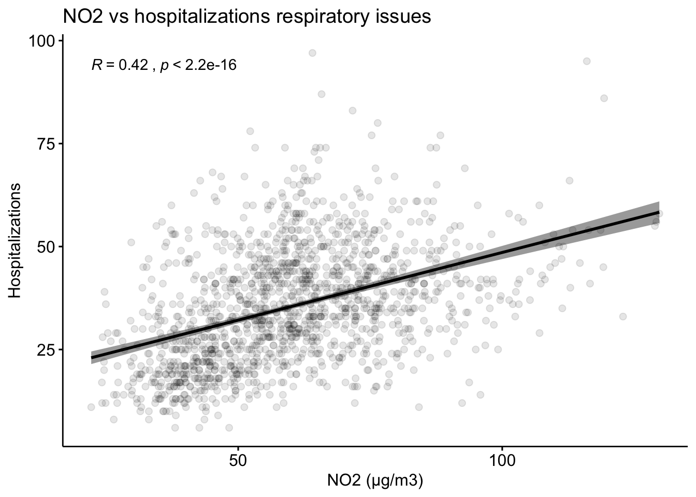

I will plot NO2 and hospitalizations with the temporal component:


```r
ggplot(df.NO2_resp, aes(x =dt)) +
  geom_line(aes(y = NO2, colour = "NO2")) +
  coord_cartesian(xlim=c(as.Date("2014-01-01"),as.Date("2014-01-16"))) +
  geom_line(aes(y = Hospitalizations_resp, colour = "Hospitalizations")) +
  labs( x = "Time", y = "Hospitalizations", title = "NO2(µg/m3) - Respiratory issues in Eixample - week") +
  scale_x_date(date_breaks = "2 days", date_labels = "%d-%b")
```

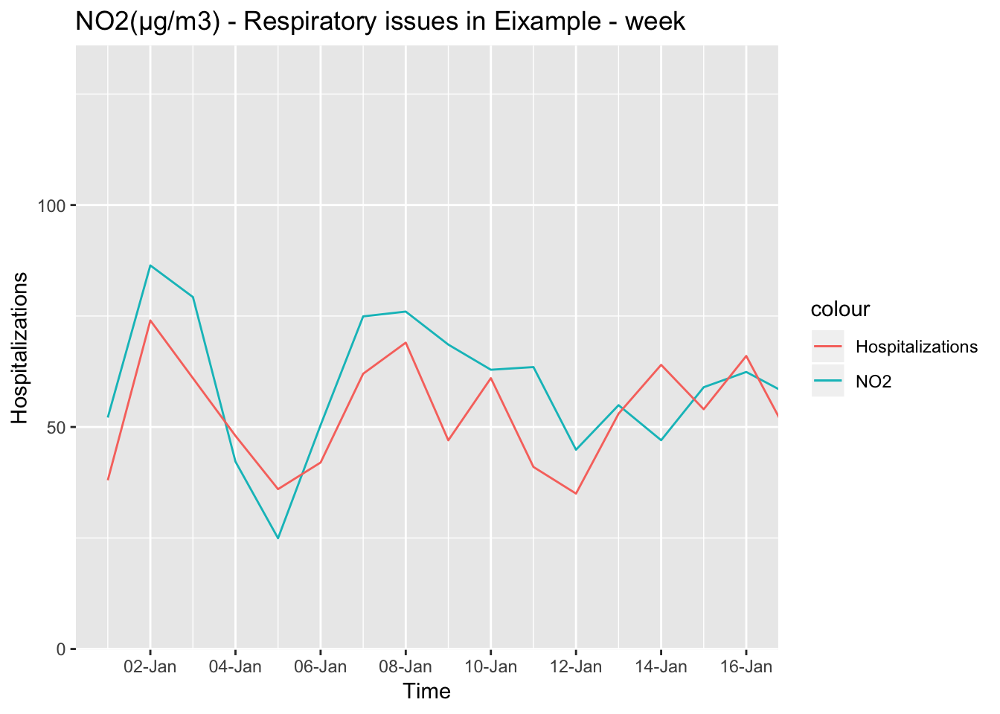


Now I will perform Pearson correlation test for PM10:

```r
cor_test2 <- cor.test(df_PM10_resp$PM10, df_PM10_resp$Hospitalizations_resp,
                method = "pearson")
cor_test2
```

```
## 
## 	Pearson's product-moment correlation
## 
## data:  df_PM10_resp$PM10 and df_PM10_resp$Hospitalizations_resp
## t = 0.96423, df = 1458, p-value = 0.3351
## alternative hypothesis: true correlation is not equal to 0
## 95 percent confidence interval:
##  -0.02609173  0.07644766
## sample estimates:
##        cor 
## 0.02524436
```
Correlation coeficcient is 0.025, which is extremely low. My hypothesis is that the outliers are corrupting the result.

I will calculate a robust covariance matrix between PM10 and respiration issues, and
compare it with a classic covariance matrix:


```r
cov_PM10_resp_classic <- covClassic(cbind(df_PM10_resp$PM10,df_PM10_resp$Hospitalizations_resp), corr = TRUE)
cov_PM10_resp_classic 
```

```
## Call:
## covClassic(data = cbind(df_PM10_resp$PM10, df_PM10_resp$Hospitalizations_resp), 
##     corr = TRUE)
## 
## Classical Estimate of Correlation: 
##         V1      V2
## V1 1.00000 0.02524
## V2 0.02524 1.00000
## 
## Classical Estimate of Location: 
##    V1    V2 
## 31.36 35.44
```

```r
cov_PM10_resp_rob <- covRob(cbind(df_PM10_resp$PM10,df_PM10_resp$Hospitalizations_resp), corr = TRUE)
cov_PM10_resp_rob
```

```
## Call:
## covRob(data = cbind(df_PM10_resp$PM10, df_PM10_resp$Hospitalizations_resp), 
##     corr = TRUE)
## 
## Robust Estimate of Correlation: 
##         V1      V2
## V1 1.00000 0.09628
## V2 0.09628 1.00000
## 
## Robust Estimate of Location: 
##    V1    V2 
## 29.22 33.97
```

I will plot both covariance matrixes:

```r
plot(cov_PM10_resp_classic)
```

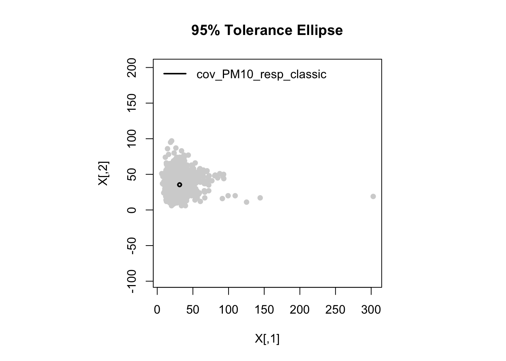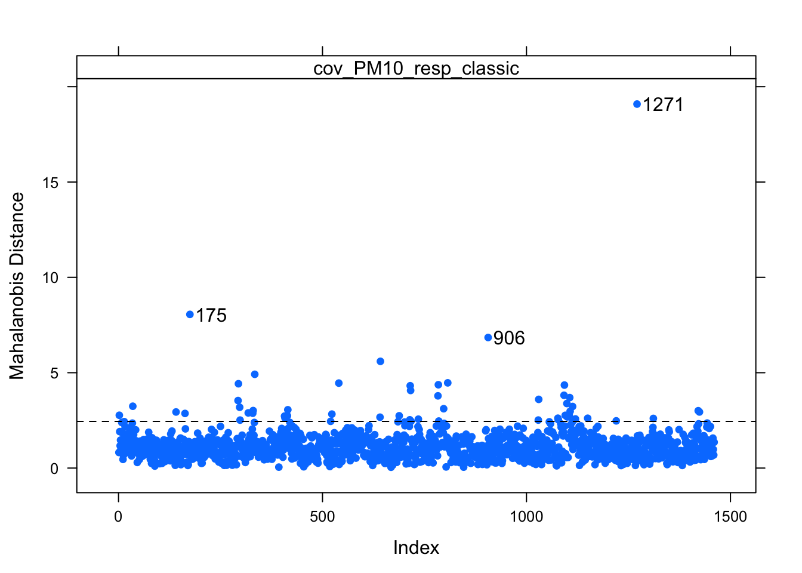


```r
plot(cov_PM10_resp_rob)
```

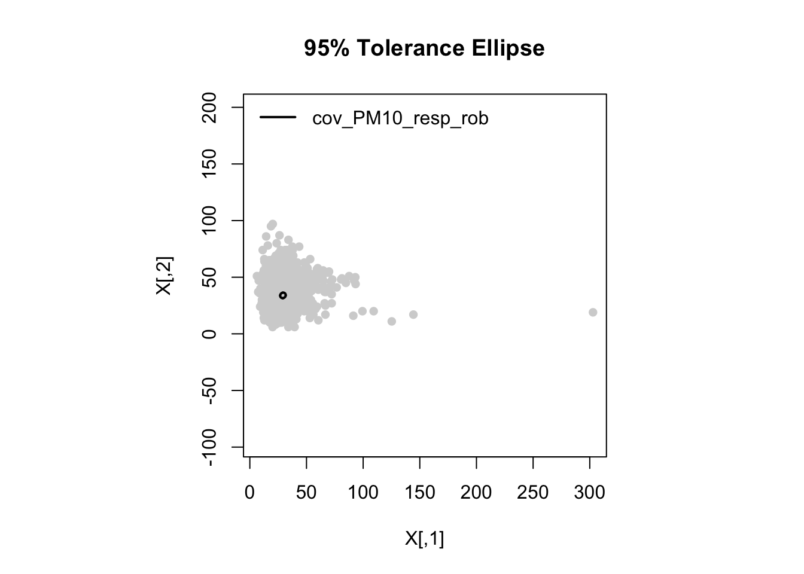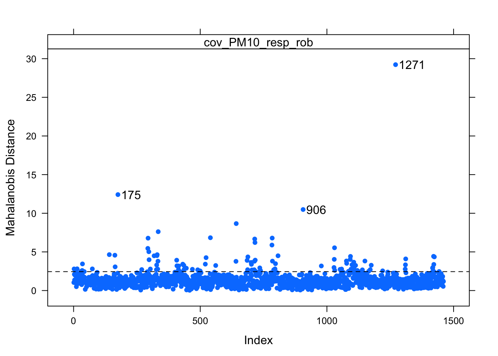

Therefore according to the data, the relationship between PM10 and hospitalizations for respiratory issues is weakly correlated. But this is not what other studies reflect, so there must be some other fact that I am missing.

I am going to do the same analysis for hospitalizations related to heart diseases. 
Please load file "Heart_2014-2017.csv".

```r
health_heart <- read_csv('/Users/ione/Desktop/Project_AIR/data/Heart_2014-2017.csv', locale = locale(encoding = "latin1"))
```

I will rename the column names

```r
health_heart <- health_heart %>% dplyr::rename(day="dia",
                                             month= "mes",
                                             year= "any",
                                             Diagnosis = "Diagnòstic Principal",
                                             Hospitalizations = "Contactes d'hospitalització d'aguts (altes AH)")
```

I translate all values of month from catalan to english:

```r
health_heart$month[health_heart$month == "Gener"] <- "January"
health_heart$month[health_heart$month == "Febrer"] <- "February"
health_heart$month[health_heart$month == "Març"] <- "March"
health_heart$month[health_heart$month == "Abril"] <- "April"
health_heart$month[health_heart$month == "Maig"] <- "May"
health_heart$month[health_heart$month == "Juny"] <- "June"
health_heart$month[health_heart$month == "Juliol"] <- "July"
health_heart$month[health_heart$month == "Agost"] <- "August"
health_heart$month[health_heart$month == "Setembre"] <- "September"
health_heart$month[health_heart$month == "Octubre"] <- "October"
health_heart$month[health_heart$month == "Novembre"] <- "November"
health_heart$month[health_heart$month == "Desembre"] <- "December"
```


```r
health_heart$dt <- paste(health_heart$year, health_heart$month, health_heart$day, sep="-") %>% ymd() %>% as.Date()
```


```r
Eixample_NO2_heart <- merge(Eixample_NO2_day,health_heart,by="dt" )
Eixample_PM10_heart <- merge(Eixample_PM10_day,health_heart,by="dt" )
```

I am now going to aggregate data,avg for NO2 and sum for hospitalizations:

```r
df_NO2_1 <- data.table(Eixample_NO2_heart)
df_NO2_heart <- df_NO2_1[, list(NO2=mean(mean), Hospitalizations_heart=sum(Hospitalizations)),
             by=dt]
df_NO2_heart
```

```
##               dt      NO2 Hospitalizations_heart
##    1: 2014-01-01 52.13043                     27
##    2: 2014-01-02 86.39583                     51
##    3: 2014-01-03 79.27083                     47
##    4: 2014-01-04 42.18750                     44
##    5: 2014-01-05 24.93750                     37
##   ---                                           
## 1457: 2017-12-27 37.54167                     24
## 1458: 2017-12-28 61.68750                     24
## 1459: 2017-12-29 72.54167                     13
## 1460: 2017-12-30 56.47917                      6
## 1461: 2017-12-31 47.93617                      1
```


```r
df_PM10_1 <- data.table(Eixample_PM10_heart)
df_PM10_heart <- df_PM10_1[, list(PM10=mean(mean), Hospitalizations_heart=sum(Hospitalizations)),
                   by=dt]
df_PM10_heart
```

```
##               dt     PM10 Hospitalizations_heart
##    1: 2014-01-01 20.04348                     27
##    2: 2014-01-02 37.72917                     51
##    3: 2014-01-03 40.41667                     47
##    4: 2014-01-04 20.85417                     44
##    5: 2014-01-05 10.45833                     37
##   ---                                           
## 1457: 2017-12-27 18.22917                     24
## 1458: 2017-12-28 17.95833                     24
## 1459: 2017-12-29 26.39583                     13
## 1460: 2017-12-30 25.95833                      6
## 1461: 2017-12-31 20.12766                      1
```

Now I will perform the Pearson correlation test between NO2, PM10 and hospitalizations caused by heart issues:


```r
cor_NO2_heart <- cor.test(df_NO2_heart$NO2, df_NO2_heart$Hospitalizations_heart,
                method = "pearson")
cor_NO2_heart
```

```
## 
## 	Pearson's product-moment correlation
## 
## data:  df_NO2_heart$NO2 and df_NO2_heart$Hospitalizations_heart
## t = 22.073, df = 1459, p-value < 2.2e-16
## alternative hypothesis: true correlation is not equal to 0
## 95 percent confidence interval:
##  0.4608750 0.5378185
## sample estimates:
##       cor 
## 0.5003339
```

The correlation coefficient between NO2 and heart issues is 0.50, which is significant. 


```r
cor_PM10_heart <- cor.test(df_PM10_heart$PM10, df_PM10_heart$Hospitalizations_heart,
                          method = "pearson")
cor_PM10_heart
```

```
## 
## 	Pearson's product-moment correlation
## 
## data:  df_PM10_heart$PM10 and df_PM10_heart$Hospitalizations_heart
## t = 4.8236, df = 1459, p-value = 1.558e-06
## alternative hypothesis: true correlation is not equal to 0
## 95 percent confidence interval:
##  0.07448119 0.17544481
## sample estimates:
##       cor 
## 0.1252874
```

The cor coef between PM10 and heart issues is just 0.125, which is quite weak.

If I plot hospitalizations vs NO2 concentrations, there is some positive relationship:

```r
ggscatter(df_NO2_heart, x = "NO2", y = "Hospitalizations_heart",
          add = "reg.line",
          conf.int = TRUE,
          add.params = list(color = "blue",
                            fill = "lightgray") ) +
  stat_cor(method = "pearson", label.x = 3, label.y = 65)  # Add correlation coefficient
```

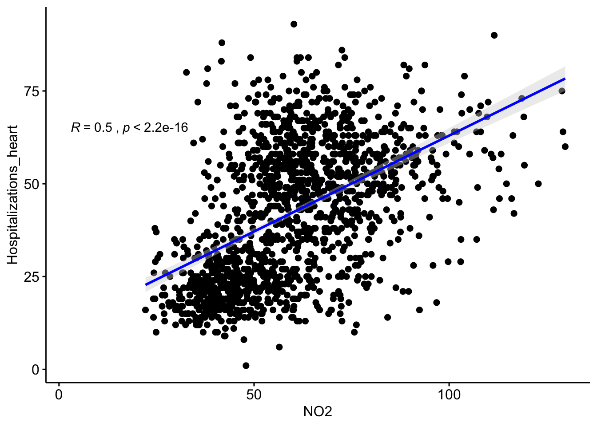

For PM10 in the contrary the relationship is not clear when plotting, probably due to the outliers.

```r
ggscatter(df_PM10_heart, x = "PM10", y = "Hospitalizations_heart",
          add = "reg.line",
          conf.int = TRUE,
          add.params = list(color = "blue",
                            fill = "lightgray") ) +
  stat_cor(method = "pearson", label.x = 3, label.y = 100)
```

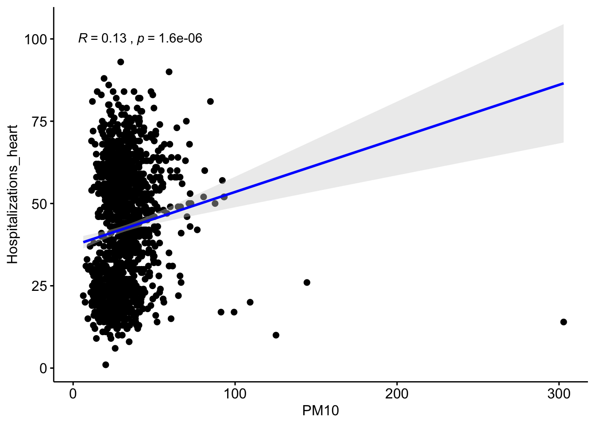

I will try to do the correlation analysis for PM10 with a robust analytical covariance method
so that the effect of the outliers is reduced.


```r
cov_PM10_heart_classic <- covClassic(cbind(df_PM10_heart$PM10,df_PM10_heart$Hospitalizations_heart), corr = TRUE)
cov_PM10_heart_classic
```

```
## Call:
## covClassic(data = cbind(df_PM10_heart$PM10, df_PM10_heart$Hospitalizations_heart), 
##     corr = TRUE)
## 
## Classical Estimate of Correlation: 
##        V1     V2
## V1 1.0000 0.1253
## V2 0.1253 1.0000
## 
## Classical Estimate of Location: 
##    V1    V2 
## 31.35 42.32
```


```r
cov_PM10_heart_rob <- covRob(cbind(df_PM10_heart$PM10,df_PM10_heart$Hospitalizations_heart), corr = TRUE)
cov_PM10_heart_rob
```

```
## Call:
## covRob(data = cbind(df_PM10_heart$PM10, df_PM10_heart$Hospitalizations_heart), 
##     corr = TRUE)
## 
## Robust Estimate of Correlation: 
##        V1     V2
## V1 1.0000 0.2404
## V2 0.2404 1.0000
## 
## Robust Estimate of Location: 
##    V1    V2 
## 29.08 41.45
```

With the robust method the covariance is up to 0.24.If I plot both the classic and the robust:


```r
plot(cov_PM10_heart_classic)
```

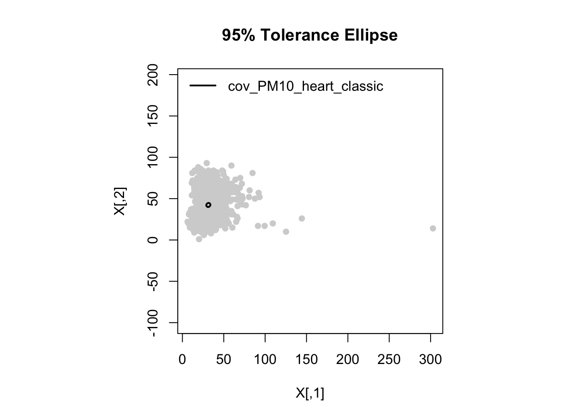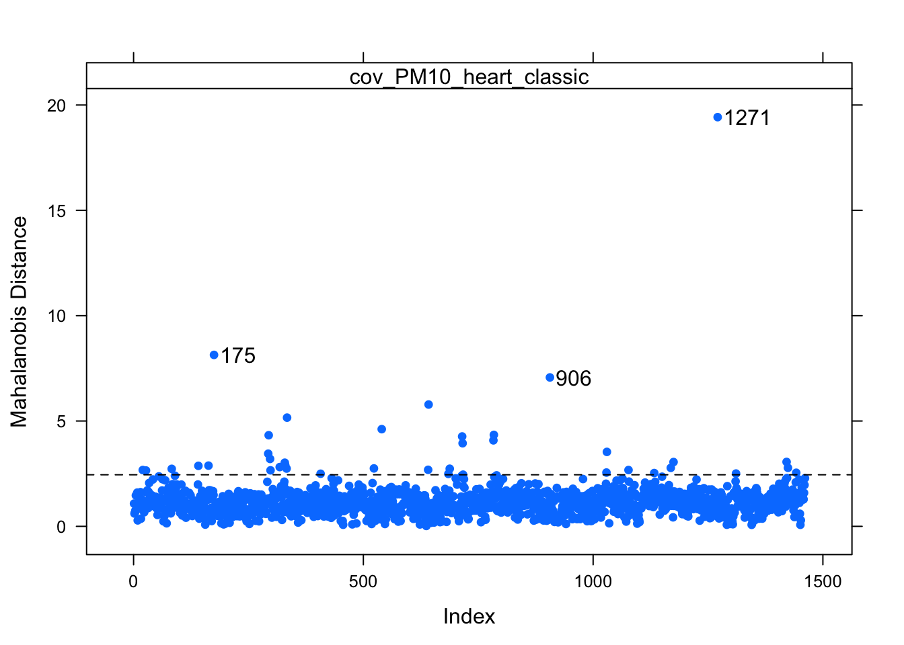


```r
plot(cov_PM10_heart_rob)
```

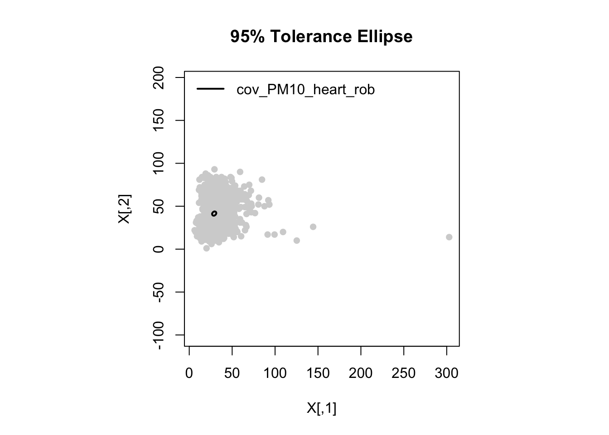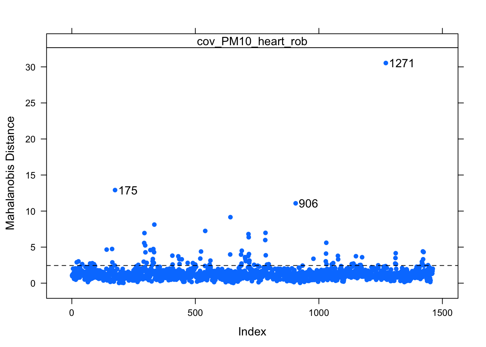


Between NO2 and hospitalizations due to respiratory issues there is some positive relationship with correlation coefficient of 0.42, and between NO2 and hospitalizations due to heart problems is moderate with a correlation coefficient of 0.5.

But PM10 and hospitalizations with respiratory problems are weakly linked with a correlation of 0.1, and PM10 and hospitalizations due to heart problems are linked with a correlation of 0.24.

# Forecasting

To predict pollution values is essential for local government, environmental or health agencies, to be able to anticipate and establish procedures to reduce the severity of local pollution levels.

But it's also helpful for citizens because forecasting helps people plan ahead, and be able to decrease the effects on health and the costs associated.

As we have seen, air pollution levels are strongly correlated with local weather conditions and nearby pollution emissions.However, long-range transport of pollution - through strong winds - is also a significant influencing factor and must be taken into consideration when forecasting local readings.

Predicting air quality, therefore, not only involves the difficulties of weather forecasting, it also requires data on and knowledge of:

- Local pollutant concentrations and emissions 
- Pollutant concentrations and emissions from distant locations 
- Movements and possible transformations of pollutants
- Prevailing winds

So forecasting pollution is much more complex than predicting the weather, but it's vital and I will try to analyze and implement. 

For forecasting I am going to focus in Eixample, and pollutant NO2 only. I will generate 3 different training sets:
- Data for 4 years from 2014 to 2018. 
- Data for 1 year from 2018.
- Data for 1 month of 2018, September. 

Please load files "Eixample_NO2_2014_2018.csv", "Eixample_NO2_2018.csv", and "Eixample_NO2_2018_09.csv". You can find the R script [here](https://github.com/Ionetxu/Project_AIR/blob/master/Forecasting_models.R)


```r
library(readr)
library(dplyr)
library(tidyr)
library(purrr)
library(lubridate)
library(ggplot2)
library(stringr)
library(knitr)
library(xts)
library(zoo)
library(gridExtra)
library(fpp2)
library(RcppRoll)
library(kableExtra)
library(imputeTS)
library(ggfortify)
library(urca)
library(forecast)

Eixample_NO2_2014_2018 <- read_csv('/Users/ione/Desktop/Project_AIR/data/Eixample_NO2_2014_2018.csv')
Eixample_NO2_2018 <- read_csv('/Users/ione/Desktop/Project_AIR/data/Eixample_NO2_2018.csv')
Eixample_NO2_2018_09 <- read_csv('/Users/ione/Desktop/Project_AIR/data/Eixample_NO2_2018_09.csv')
```


I am going to transform the dataframes into ts time series objects:


```r
Eixample_NO2_ts <- ts(Eixample_NO2_2014_2018[,10], frequency = 24)
Eixample_NO2_2018_ts <- ts(Eixample_NO2_2018[,10], frequency = 24)
Eixample_NO2_2018_09_ts <- ts(Eixample_NO2_2018_09[,10], frequency = 24)
```

I am going to plot each time series now to see how they look:


```r
autoplot(Eixample_NO2_ts)
```

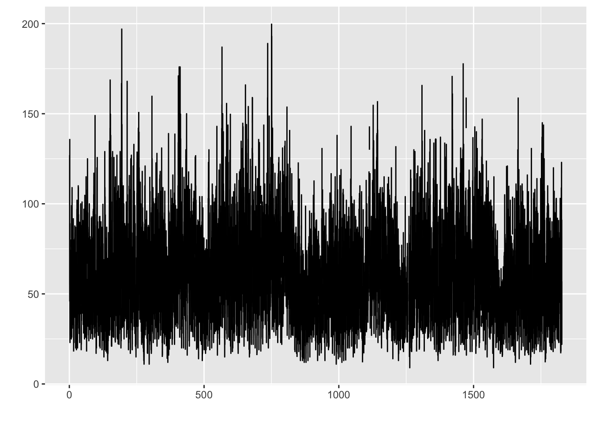


```r
autoplot(Eixample_NO2_2018_ts)
```

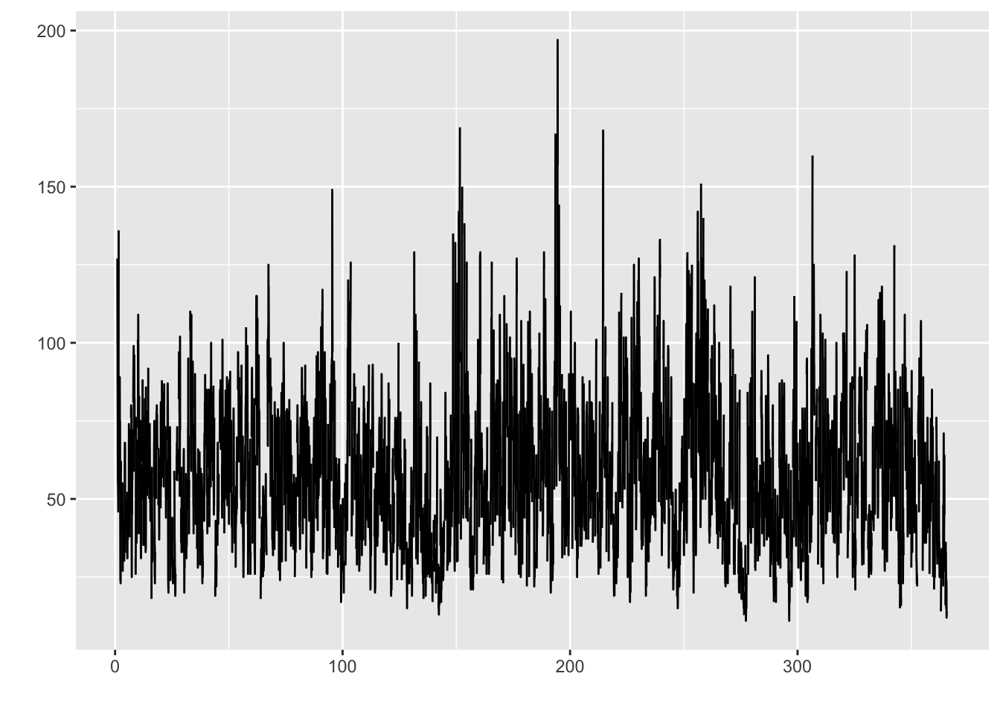


```r
autoplot(Eixample_NO2_2018_09_ts)
```

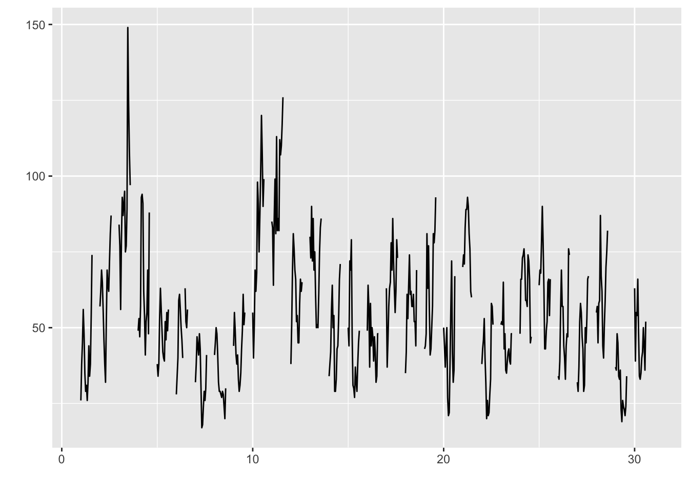

I am going to input NA values by using interpolation method:

```r
imp_2014_2018_NO2_Eixample_intp <- na.interpolation(Eixample_NO2_ts)
imp_2018_NO2_Eixample_intp <- na.interpolation(Eixample_NO2_2018_ts)
imp_2018_09_NO2_Eixample_intp <- na.interpolation(Eixample_NO2_2018_09_ts)
```

I'm going to plot one time series with the na interpolations:


```r
plotNA.imputations(x.withNA = Eixample_NO2_2018_09_ts, x.withImputations = imp_2018_09_NO2_Eixample_intp)
```

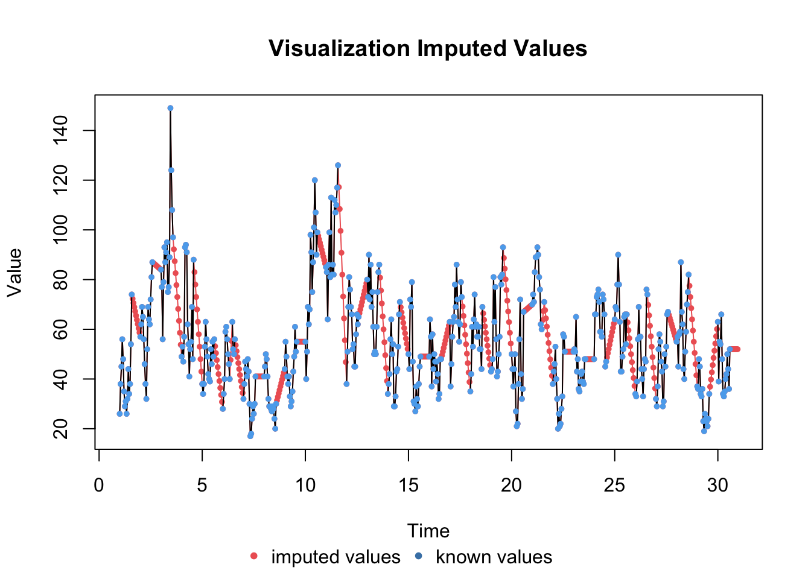

Decomposition of an additive times series for the month long period:

```r
Eixample_NO2_Comp <- decompose(imp_2018_09_NO2_Eixample_intp)
plot(Eixample_NO2_Comp)
```

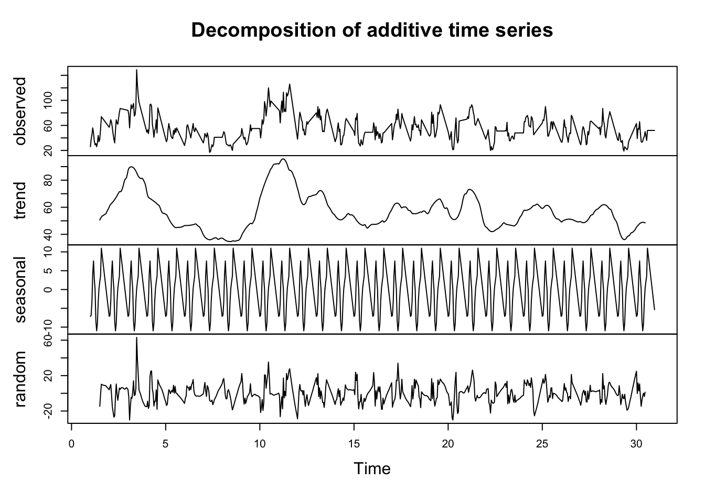

We observe the daily seasonality in the decomposition.

Also I can see the trend, seasonality, and what is the autocorrelation level or the linear relationship between lagged values of our time series.

I will plot the autocorrelation coefficients or a correlogram to show the autocorrelation function or ACF.


```r
ggAcf(imp_2014_2018_NO2_Eixample_intp)
```

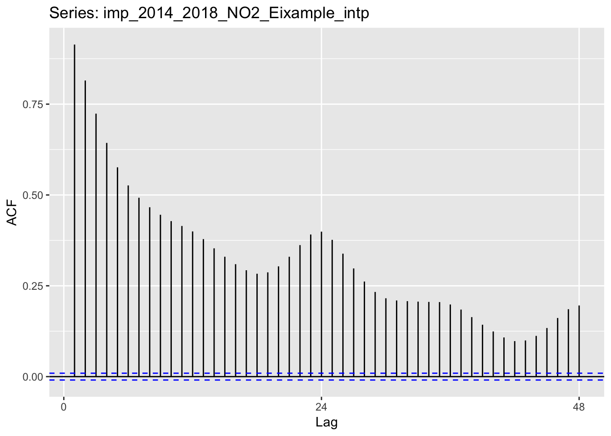

We observe that we have at least a daily seasonality with peaks in lag=24 and multiples.
We also have a trend, because the autocorrelations for small lags are large and positive, and observations nearby in time are similar size that decrease as the lags increase.
The lags decrease because of the trend, and they have a “scalloped” shape due to the seasonality, in lag=24 and multiples.

To evaluate the model, I am going to generate 3 training sets, and see what works best.

Train1: 2014-01 to 2018-11, Test: 2018-12
Train2: 2018-01 to 2018-11, Test: 2018-12
Train3: 2018-09-1 to 2018-09-27, Test: 2018-09-28 to 2018-09-30


```r
train1 <- subset(imp_2014_2018_NO2_Eixample_intp, end=length(imp_2014_2018_NO2_Eixample_intp)-31*24)
train2 <- subset(imp_2018_NO2_Eixample_intp, end = length(imp_2018_NO2_Eixample_intp) - 31*24)
train3 <- subset(imp_2018_09_NO2_Eixample_intp, end = length(imp_2018_09_NO2_Eixample_intp) - 3*24)
```

I am going to create a very simple baseline with some simple forecasting methods like naive,
seasonal naive, and average methods, and we are going to compare them.

I will first create a very basic model using the average method.

For train1 dataset, with 4 year data, we are going to try forecasting 24 h. 

```r
fcavg1 <- meanf(train1, h=24)
```


```r
checkresiduals(fcavg1)
```

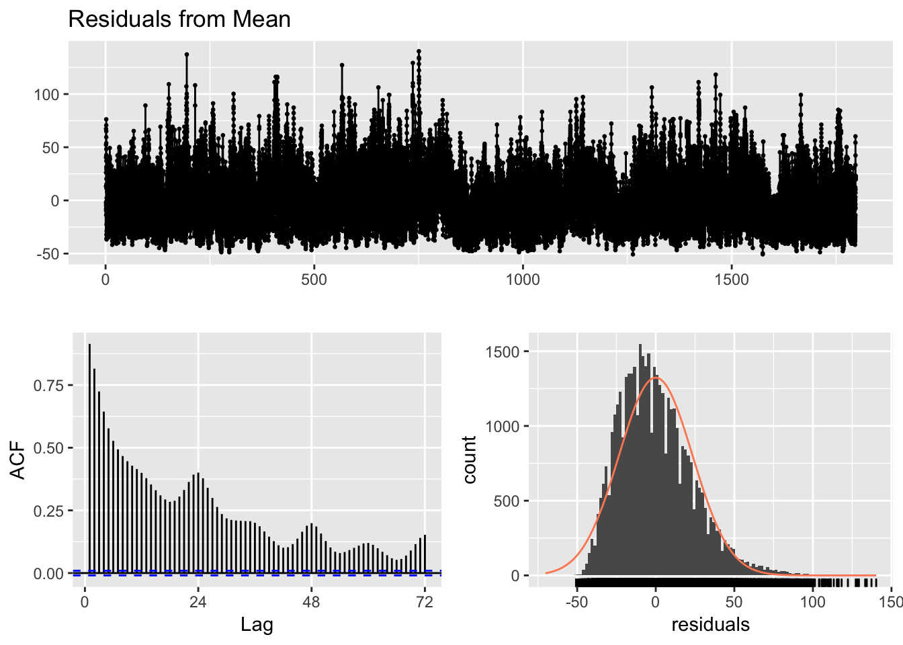

```
## 
## 	Ljung-Box test
## 
## data:  Residuals from Mean
## Q* = 286600, df = 47, p-value < 2.2e-16
## 
## Model df: 1.   Total lags used: 48
```

The residuals seem to be strongly correlated and the mean is not zero, so there is a lot of room for improvement.


```r
acavg1 <- accuracy(fcavg1,imp_2014_2018_NO2_Eixample_intp)
acavg1
```

```
##                         ME     RMSE      MAE       MPE     MAPE      MASE
## Training set -2.422543e-15 23.41828 18.52812 -17.83864 38.20774 0.9465105
## Test set      8.878874e+00 14.60153 11.09775  10.51279 14.78259 0.5669293
##                  ACF1 Theil's U
## Training set 0.914165        NA
## Test set     0.761984  1.464202
```

I will create the average model for the other two training sets:

```r
fcavg2 <- meanf(train2, h=24)
acavg2 <- accuracy(fcavg2,imp_2018_NO2_Eixample_intp)
acavg2
```

```
##                        ME     RMSE      MAE       MPE     MAPE      MASE
## Training set 9.083770e-16 22.69295 18.01841 -17.26566 37.58413 0.9096043
## Test set     2.547705e+01 33.06056 29.48470  24.23142 32.86620 1.4884445
##                   ACF1 Theil's U
## Training set 0.9048683        NA
## Test set     0.8842593  2.486766
```


```r
fcavg3 <- meanf(train3, h=24)
acavg3 <- accuracy(fcavg3,imp_2018_09_NO2_Eixample_intp)
acavg3
```

```
##                        ME     RMSE      MAE         MPE     MAPE      MASE
## Training set 1.786583e-15 19.16832 15.04658 -12.1881287 30.19554 0.9039163
## Test set     2.898148e+00 12.92619 10.29205   0.4973661 17.13705 0.6182901
##                   ACF1 Theil's U
## Training set 0.8797162        NA
## Test set     0.6311693   1.24153
```


```r
autoplot(fcavg3)
```

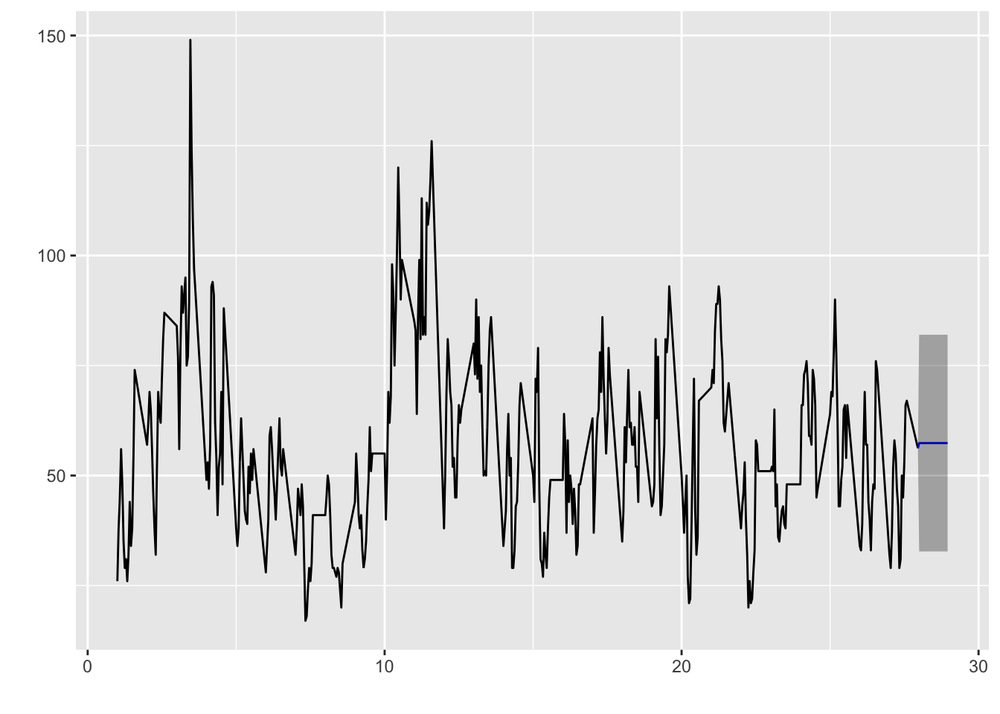

The best model so far is fcavg3 with RMSE 12.92, but it can be surely improved,so I will now try the Seasonal Naïve METHOD.


```r
fcsn1 <- snaive(train1, h = 24)
acsnm1 <- accuracy(fcsn1,imp_2014_2018_NO2_Eixample_intp)
acsnm1
```

```
##                        ME     RMSE      MAE       MPE     MAPE     MASE
## Training set -0.007520891 25.62021 19.57519 -10.65701 37.41261 1.000000
## Test set     -7.437500000 28.88746 24.85417 -16.72899 37.18899 1.269677
##                   ACF1 Theil's U
## Training set 0.8823099        NA
## Test set     0.8019205  3.637674
```


```r
fcsn2 <- snaive(train2, h = 24)
acsnm2 <- accuracy(fcsn2,imp_2018_NO2_Eixample_intp)
acsnm2
```

```
##                       ME     RMSE      MAE        MPE     MAPE     MASE
## Training set -0.05061311 25.99450 19.80907 -10.846521 38.01660 1.000000
## Test set     11.56250000 24.75265 21.56250   6.647138 27.10735 1.088517
##                   ACF1 Theil's U
## Training set 0.8772091        NA
## Test set     0.8161219  2.257468
```


```r
fcsn3 <- snaive(train3, h = 24)
acsnm3 <- accuracy(fcsn3,imp_2018_09_NO2_Eixample_intp)
acsnm3
```

```
##                      ME     RMSE      MAE       MPE     MAPE      MASE
## Training set 0.06971154 22.40050 16.64599 -7.896603 31.45541 1.0000000
## Test set     8.47916667 14.39133 11.85417 12.677672 19.96869 0.7121333
##                   ACF1 Theil's U
## Training set 0.8489884        NA
## Test set     0.5685643  1.337942
```


```r
autoplot(fcsn3)
```

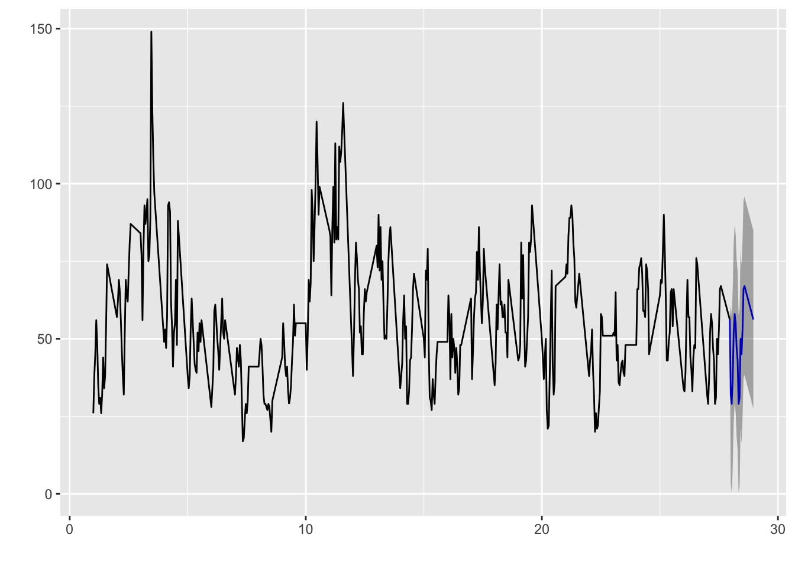

It seems that the Seasonal Naive Method has not improved much the mean method, as so far the best model has been the mean model fcavg3 with 1 month training set (train3) with RMSE of 12.92.

I am now going to try some exponential smoothing forecasting methods.
Forecasts produced using exponential smoothing methods are weighted averages of past observations,
with the weights decaying exponentially as the observations get older. The more recent the observation, the higher the associated weight.

The Holt-Winters seasonal method comprises the forecast equation and three smoothing equations — one for the level ℓt, one for the trend bt, and one for the seasonal component st, with corresponding smoothing parameters α, β∗ and γ. We use m to denote the frequency of the seasonality, i.e., the number of seasons in a year.


```r
fhw1 <- hw(train1, seasonal = "additive", h = 24)
```

Check that the residuals look like white noise

```r
checkresiduals(fhw1)
```

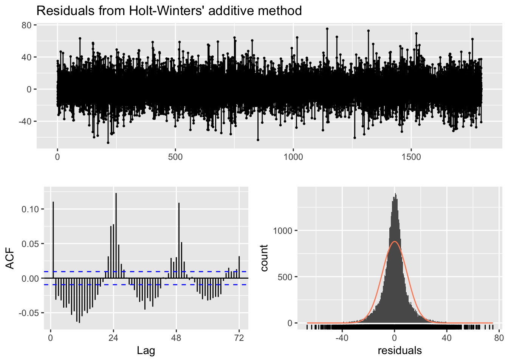

```
## 
## 	Ljung-Box test
## 
## data:  Residuals from Holt-Winters' additive method
## Q* = 3918.2, df = 20, p-value < 2.2e-16
## 
## Model df: 28.   Total lags used: 48
```

Calculate the accuracy of the model

```r
achw1 <- accuracy(fhw1, imp_2014_2018_NO2_Eixample_intp)
achw1
```

```
##                       ME      RMSE       MAE        MPE     MAPE      MASE
## Training set  0.08692546  9.565536  6.566569  -1.258247 12.18857 0.3354537
## Test set     -6.45561654 12.456080 10.417207 -10.823803 15.88906 0.5321638
##                   ACF1 Theil's U
## Training set 0.1105364        NA
## Test set     0.7773539  1.593672
```

I will do the same for the training period 2 (for whole year 2018)

```r
fhw2 <- hw(train2, seasonal = "additive", h = 24)
```


```r
achw2 <- accuracy(fhw2, imp_2018_NO2_Eixample_intp)
achw2
```

```
##                      ME      RMSE      MAE       MPE     MAPE      MASE
## Training set  0.1352854  9.345555  6.14209 -1.093629 11.29442 0.3100646
## Test set     -1.8618327 17.345534 14.38008 -9.296462 21.50013 0.7259340
##                     ACF1 Theil's U
## Training set 0.008890979        NA
## Test set     0.887359709  2.104266
```

I will do the same for the training period 3 (for september 2018)

```r
fhw3 <- hw(train3, seasonal = "additive", h = 24)
```


```r
autoplot(fhw3)
```

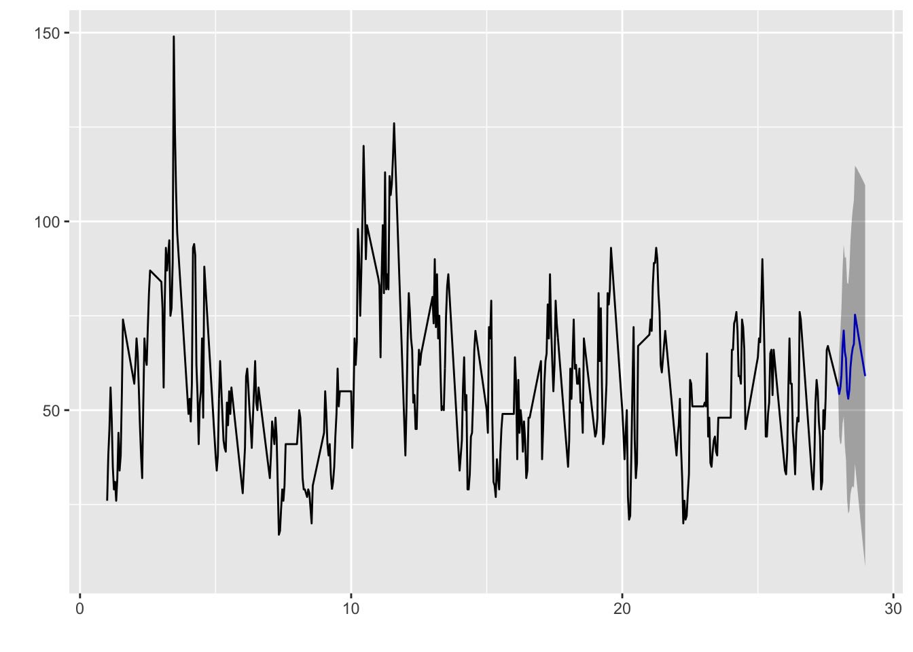


```r
checkresiduals(fhw3)
```

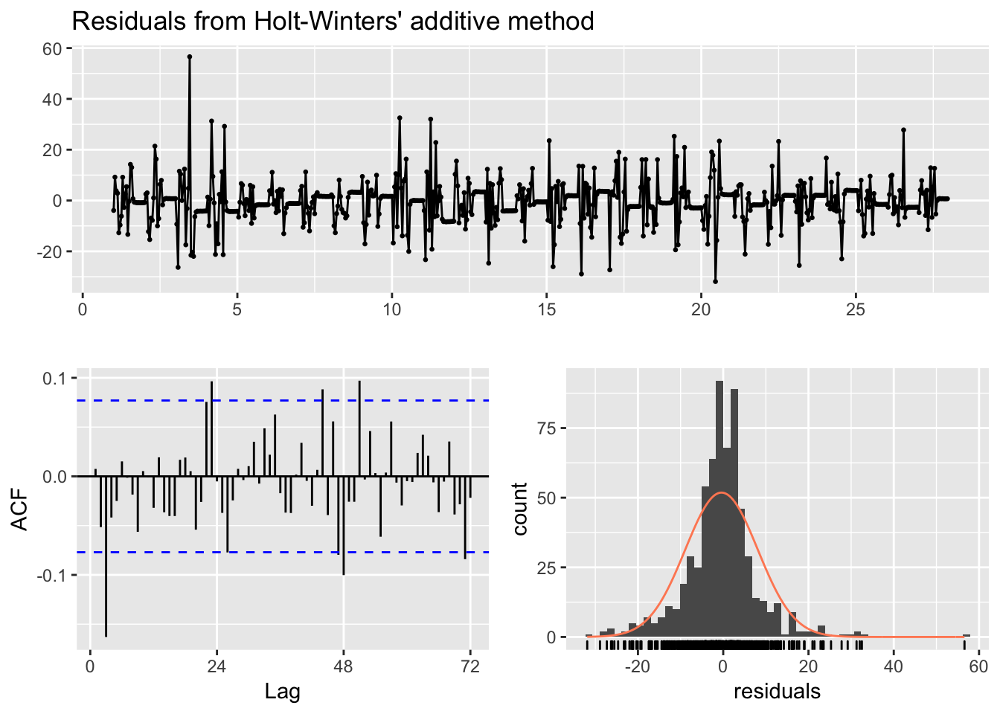

```
## 
## 	Ljung-Box test
## 
## data:  Residuals from Holt-Winters' additive method
## Q* = 74.873, df = 20, p-value = 2.861e-08
## 
## Model df: 28.   Total lags used: 48
```


```r
achw3 <- accuracy(fhw3, imp_2018_09_NO2_Eixample_intp)
achw3
```

```
##                      ME     RMSE      MAE       MPE     MAPE      MASE
## Training set -0.4031084 8.491798 5.760773 -1.976917 10.81360 0.3460756
## Test set     -3.5367808 9.931202 8.256685 -9.041486 15.23381 0.4960163
##                     ACF1 Theil's U
## Training set 0.007553314        NA
## Test set     0.401247312  1.104942
```

With Holt-Winters seasonal additive method,  we get the best RMSE = 9.93 so far, with train set 3 (September 2018). The residuals look like white noise, with small autocorrelation coefficients under 0.1 and with mean centered in 0. 

Exponential smoothing methods can have multiple variations depending of the combinations of the trend and seasonality being additive or multiplicative. So Seasonal Holt-Winders is an additive trend and additive seasonal method, but for example I could have a (A,M) method, which would have a additive trend and multiplicative seasonality. 

Also a model can have an additive or multiplicative error, adding a third parameter to the exponential smoothing methods, the error. They are called also ETS, for error, trend and seasonality. The possibilities for each component are: Error ={A,M}, Trend ={N,A,Ad} and Seasonal ={N,A,M}.

I wil use the ETS method to forecast our time series:

```r
fitets1 <- ets(train1)
e1 <- fitets1 %>% forecast(h = 24) %>% accuracy(imp_2014_2018_NO2_Eixample_intp)
e1
```

```
##                       ME     RMSE       MAE        MPE     MAPE      MASE
## Training set  -0.0876561  9.77353  6.607668  -1.621631 11.86540 0.3375532
## Test set     -11.5514832 17.08266 13.978419 -18.195275 21.49077 0.7140886
##                   ACF1 Theil's U
## Training set 0.1423023        NA
## Test set     0.7927134  2.196444
```

With 4 years training, it returns an ETS(M,N,M) model with no white noise(p-value < 2.2e-16) and RMSE = 17.08266.


```r
fitets2 <- ets(train2)
e2 <- fitets2 %>% forecast(h = 24) %>% accuracy(imp_2018_NO2_Eixample_intp)
e2
```

```
##                        ME      RMSE       MAE       MPE     MAPE      MASE
## Training set  0.002282833  9.395696  6.188579 -1.385050 11.37992 0.3124114
## Test set     -1.286698541 17.324459 14.446887 -8.612021 21.53933 0.7293068
##                    ACF1 Theil's U
## Training set 0.01930377        NA
## Test set     0.88231930  2.099396
```

With 11 months training, it returns an ETS(M,N,A) model with no white noise (p-value < 2.2e-16) and RMSE = 18.213865.


```r
fitets3 <- ets(train3)
fitets3 %>% forecast(h = 24) %>% autoplot()
```

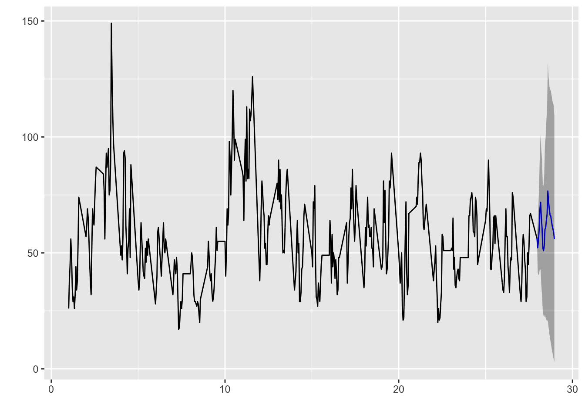


```r
summary(fitets3)
```

```
## ETS(M,Ad,M) 
## 
## Call:
##  ets(y = train3) 
## 
##   Smoothing parameters:
##     alpha = 0.8487 
##     beta  = 1e-04 
##     gamma = 2e-04 
##     phi   = 0.9799 
## 
##   Initial states:
##     l = 36.9071 
##     b = 1.0543 
##     s = 0.8994 0.9476 0.9705 0.9927 1.025 1.0601
##            1.0669 1.109 1.1557 1.2327 1.0738 1.0313 0.9797 0.9651 0.8508 0.819 0.8417 0.9776 1.0493 1.1546 1.1029 0.9667 0.8884 0.8395
## 
##   sigma:  0.1586
## 
##      AIC     AICc      BIC 
## 7018.535 7021.549 7152.751 
## 
## Training set error measures:
##                       ME     RMSE      MAE       MPE    MAPE      MASE
## Training set -0.04703844 8.779863 5.954116 -1.439148 10.9715 0.3576907
##                    ACF1
## Training set 0.05729307
```


```r
e3 <- fitets3 %>% forecast(h = 24) %>% accuracy(imp_2018_09_NO2_Eixample_intp)
e3
```

```
##                       ME     RMSE      MAE       MPE     MAPE      MASE
## Training set -0.04703844 8.779863 5.954116 -1.439148 10.97150 0.3576907
## Test set     -1.93475890 9.452193 8.034722 -6.176874 14.46853 0.4826820
##                    ACF1 Theil's U
## Training set 0.05729307        NA
## Test set     0.40502783  1.025611
```

With one month training, it returns an ETS(M, Ad, M) model with no white noise (p-value = 7.387e-10) and RMSE = 9.452193

Still, for some reason the forecast plot doesn't look too good, I wonder if the time series is stationary or white noise and don't have a predictable patter in the long term. 

I will perform the Kwiatkowski-Phillips-Schmidt-Shin (KPSS) test (Kwiatkowski, Phillips, Schmidt, & Shin, 1992).
In this test, the null hypothesis is that the data are stationary, and we look for evidence
that the null hypothesis is false.
Consequently, small p-values (e.g., less than 0.05) suggest that differencing is required.


```r
train1 %>% ur.kpss() %>% summary()
```

```
## 
## ####################### 
## # KPSS Unit Root Test # 
## ####################### 
## 
## Test is of type: mu with 18 lags. 
## 
## Value of test-statistic is: 1.9162 
## 
## Critical value for a significance level of: 
##                 10pct  5pct 2.5pct  1pct
## critical values 0.347 0.463  0.574 0.739
```

Value of test-statistic is: 1.9162 so we can discard that it's a stationary time series. 

We can transform non-stationary to stationary by computing the differences between consecutive observations, and stabilising the variance of the time series. Differencing can help stabilise the mean of a time series by removing changes in the level of a time series, and therefore eliminating (or reducing) trend and seasonality.

I will apply a seasonal ARIMA model next to our training sets. The seasonal ARIMA models have two sets of parameters (p,d,q)(P,D,Q), p related to the order of the autorregression or AR part, d if differencing is required and q to the order of the moving average part. P,D,Q are referring to the seasonal part of the model. 

I will use the autorima function to see what kind of model is best:


```r
fitautoarima1 <- auto.arima(train1)
checkresiduals(fitautoarima1)
```

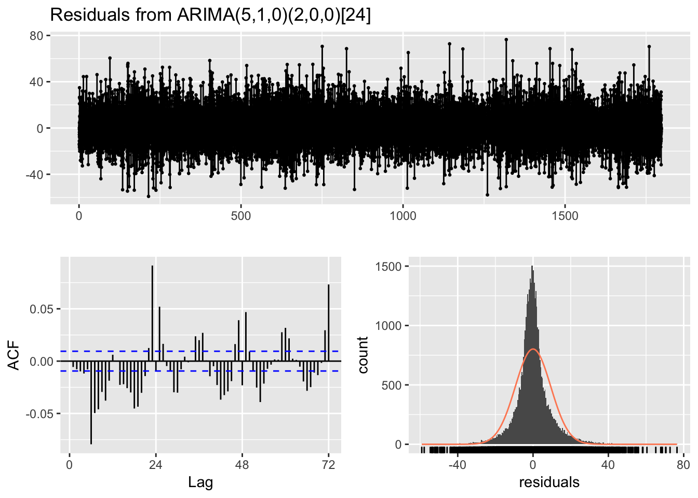

```
## 
## 	Ljung-Box test
## 
## data:  Residuals from ARIMA(5,1,0)(2,0,0)[24]
## Q* = 1877.1, df = 41, p-value < 2.2e-16
## 
## Model df: 7.   Total lags used: 48
```


```r
a1 <- fitautoarima1 %>% forecast(h = 24) %>% accuracy(imp_2014_2018_NO2_Eixample_intp)
a1
```

```
##                         ME      RMSE       MAE        MPE     MAPE
## Training set -7.712129e-04  9.407624  6.288977  -1.604437 11.39849
## Test set     -1.422385e+01 18.928269 16.284145 -24.258515 26.54918
##                   MASE         ACF1 Theil's U
## Training set 0.3212729 -0.005603022        NA
## Test set     0.8318769  0.785648127  2.580245
```

The proposed model parameters are ARIMA(5,1,0)(2,0,0)[24], so it proposes 1 differencing in the non-seasonal part of the mdel, and the order of the moving average is 0 in both parts. The autoregression order of the non-seasonal is 5, and the AR order of the seasonal 2. 

The RMSE is 18.928269, which is higher than ETS models tried before. 


```r
fitautoarima2 <- auto.arima(train2)
a2 <- fitautoarima2 %>% forecast(h = 24) %>% accuracy(imp_2018_NO2_Eixample_intp)
a2
```

```
##                        ME      RMSE       MAE       MPE     MAPE      MASE
## Training set -0.002544305  9.456613  6.240959 -2.874205 11.67962 0.3150557
## Test set     16.194115132 27.989931 23.433718 12.080689 27.47259 1.1829794
##                      ACF1 Theil's U
## Training set 6.401545e-05        NA
## Test set     8.965193e-01  2.270977
```

With training set 2, the model proposed is an ARIMA(1,0,1)(2,0,0)[24]. No differencing was required, and the AR is 1 in the non-seasonal part, 2 in the seasonal part. It has included one order of the MA part. 
The RMSE=27.99 is very high, so it doesn't look like a good model. 

I will finish with the training set 3, which is for the month of september 2018.

```r
fitautoarima3 <- auto.arima(train3)
summary(fitautoarima3)
```

```
## Series: train3 
## ARIMA(1,0,0)(0,0,1)[24] with non-zero mean 
## 
## Coefficients:
##          ar1    sma1     mean
##       0.8750  0.1487  57.0521
## s.e.  0.0191  0.0380   3.1789
## 
## sigma^2 estimated as 80.31:  log likelihood=-2340.01
## AIC=4688.02   AICc=4688.08   BIC=4705.91
## 
## Training set error measures:
##                      ME     RMSE      MAE       MPE     MAPE      MASE
## Training set 0.06438725 8.940968 6.024999 -2.479659 11.34568 0.3619489
##                    ACF1
## Training set 0.01792237
```


```r
fitautoarima3 %>% forecast(h=24) %>% autoplot()
```

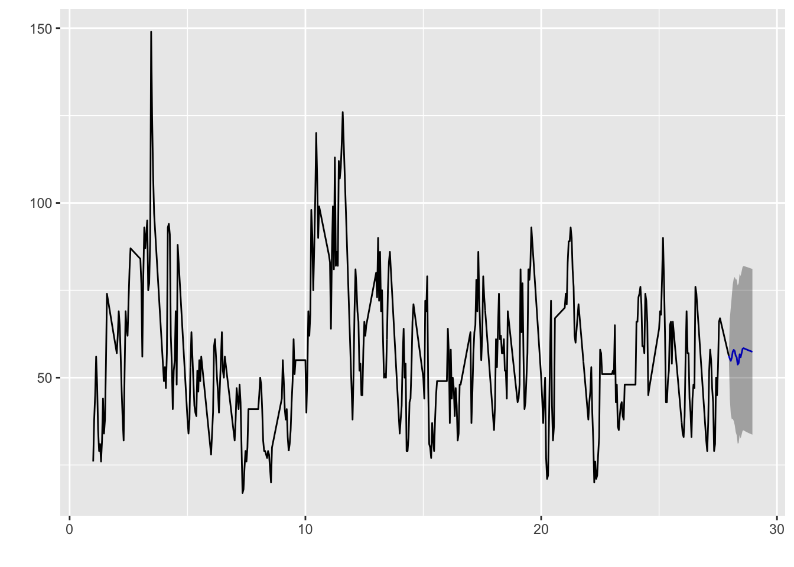


```r
a3 <- fitautoarima3 %>% forecast(h = 24) %>% accuracy(imp_2018_09_NO2_Eixample_intp)
a3
```

```
##                      ME      RMSE      MAE       MPE     MAPE      MASE
## Training set 0.06438725  8.940968 6.024999 -2.479659 11.34568 0.3619489
## Test set     3.36878022 12.348736 9.861870  1.601082 16.22775 0.5924471
##                    ACF1 Theil's U
## Training set 0.01792237        NA
## Test set     0.61470284  1.177736
```


For a training period of one month, the ARIMA(1,0,0)(0,0,1)[24] is chosen. Just one order of the AR non seasonal part, and one order of the MA seasonal part. The error RMSE= 12.34 seems to improve the other ARIMA models but it's still worse than the ETS model. 

This is not the result I was expecting and my hypothesis is that the times series have a multiple seasonality. With pollution data, we have a case of multiple seasonality with daily, weekly and yearly seasons. To deal with these maybe I should adapt my models to different training sets to avoid multiple seasonalities. If the time series is relatively short so that only one type of seasonality is present, then maybe it will be possible to use one of the single-seasonal methods like ETS or a seasonal ARIMA model.

But when the time series is long enough so that multiple seasonal periods appear, it will be necessary to use STL, dynamic harmonic regression or TBATS.

I am going to try the TBATS model, which is an automated method that uses a combination of Fourier terms with an exponential smoothing state space model and a Box-Cox transformation, in a completely automated manner. 


```r
train1 %>% tbats() -> fit_tbats
summary(fit_tbats)
```

```
##                   Length  Class  Mode     
## lambda                  1 -none- numeric  
## alpha                   1 -none- numeric  
## beta                    1 -none- numeric  
## damping.parameter       1 -none- numeric  
## gamma.one.values        1 -none- numeric  
## gamma.two.values        1 -none- numeric  
## ar.coefficients         3 -none- numeric  
## ma.coefficients         1 -none- numeric  
## likelihood              1 -none- numeric  
## optim.return.code       1 -none- numeric  
## variance                1 -none- numeric  
## AIC                     1 -none- numeric  
## parameters              2 -none- list     
## seed.states            28 -none- numeric  
## fitted.values       43104 ts     numeric  
## errors              43104 ts     numeric  
## x                 1206912 -none- numeric  
## seasonal.periods        1 -none- numeric  
## k.vector                1 -none- numeric  
## y                   43104 ts     numeric  
## p                       1 -none- numeric  
## q                       1 -none- numeric  
## call                    2 -none- call     
## series                  1 -none- character
## method                  1 -none- character
```

It's interesting because the TBATS model returns a model TBATS(0.3, {3,1}, 0.904, {<24,11>}), which it only includes 1 seasonality of 24 hours, and I know there are at least a weekly and a yearly seasonality.Box-Cox parameter is 0.3, and the damping parameter 0.904. It's a order 3 for AR and 1 for MA part. 


```r
train3 %>% tbats() -> fit_tbats3
fc3 <- forecast(fit_tbats3, h=24)
autoplot(fc3)
```

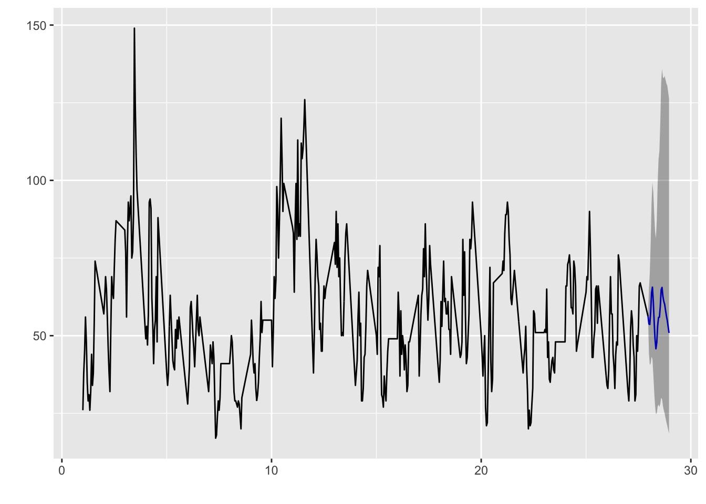


```r
acctbats3 <- accuracy(fc3,imp_2018_09_NO2_Eixample_intp)
acctbats3
```

```
##                     ME      RMSE      MAE        MPE     MAPE      MASE
## Training set 0.4618859  8.560919 5.939985 -0.9305555 10.85752 0.3568417
## Test set     3.4389851 10.318737 8.345038  2.8415146 13.33396 0.5013241
##                     ACF1 Theil's U
## Training set -0.03884427        NA
## Test set      0.50384759 0.9649302
```

The TBATS model resulted with training period of one month is a TBATS(0.113, {0,0}, 0.8, {24,7}), with just one seasonality of 24 hours, no AR or MA component, and significant 0.113 Cox-Box transformation component, with 0.8 damping parameter. The RMSE is 10.31, which is worse than the one I got with ETS(M, Ad, M) model, with RMSE = 9.452193. 

# Conclusions

I will use this last section to wrap up all the insights learned from this project.

## Data Quality

- PM 2.5 not automatically measured hourly

The first finding I encountered was that PM2.5 is not measured automatically in an hourly manner. PM2.5 is probably the most dangerous air pollutant due to its small size that they can penetrate deep in the lungs and even in the blood stream, causing not only respiratory issues but also heart related problems.

For this reason, I strongly encourage the local administration to start measuring PM2.5 in order to keep it under control and be able to act with information.

- Completeness of pollution measurement

Another important finding was that the pollution is automatically measured only between 10am and midnight 12am. This means morning rush hour pollution is not being measured, hence we don't have completeness of data. Having complete information would help not only to understand data patterns better, but also to be able to build better prediction models and be able to anticipate pollution episodes more accurately.

## Which days of the week have the cleanest air?

In terms of understanding pollution patterns, weekends have better PM10 and NO2 average concentrations than weekdays, being Fridays the day with the highest pollution for both NO2 and PM10, and Sunday the day with the cleanest air.

## Which months have the cleanest air?
Regarding the months, **August** is the cleanest month for NO2 as an average of the last five years, while **December** is the worst. It's interesting to see this as it seems like the higher temperatures in the summer doesn't seem to affect NO2 concentrations. Also, the big amount of tourists don't seem to be the cause of NO2, but probably it's locals using cars to get into the city.

For PM10 the best month with lowest average concentration and the cleanest in the last five years is **January**, and the most polluted month is **June**. This is so different from NO2 patterns that I suspect different sources are affecting each pollutant.

## What time of the day is the most polluted? And the cleanest?
4pm is the time of the day where both PM10 and NO2 are the lowest concentration. For NO2, 10am and 9pm are the most polluted times, while for PM10 10am is the most polluted time of the day. 
This is according to the data we have, as there might be another pollution peak before 10am that is not being measured currently. 

## Compliance with EU Air Quality Legislation?
NO2 yearly average levels have breach the limits set by EU air quality legislation in the last years. Barcelona, among other cities, has been warned to implement air quality plans and set out appropriate measures to bring this situation to an end as soon as possible. See some news about this [here](http://europa.eu/rapid/press-release_IP-17-238_en.htm).

In contrast, yearly average levels of PM10 are complient with the EU legislation. But the hourly limit has been breach with extremely high concentrations of PM10, specially in June. The highest concentrations (with max value of 1409 µg/m3 in 2017, with daily average limit being 50 µg/m3) happen to be around 23rd and 24th June, on **Sant Joan**, where the city celebrates summer solstice with bonfires, fireworks and firecrackers. Firecrackers are extremely pollutant, and they should be regulated like in China or India, where fireworks have been banned for Lunar New Year or Diwali festivities.

## Weather impacts to pollution

Weather is one of the components that has more effect on air pollution. In Barcelona, **NO2** pollutant is most affected by **wind speed** and **wind direction**. The optimal wind direction for lower NO2 concentration would be **North West**, while when the wind is South East the NO2 pollution is higher.

Regarding **PM10**, it's most affected by temperature and wind direction, being **North West** winds best to clean the air in the city.

## Pollution's relationship with medical issues

Hospitalizations for respiratory and heart issues are moderately correlated to NO2 pollution levels, while PM10 is somewhat correlated but I was not able to find strong relations neither with respiratory or heart related hospitalizations.  

## Forecasting pollution
Forecasting pollution is extremely complex due to the high variability of the process, but it's important to be able to anticipate high pollution episodes in order to take actions and protect the citizens. 

## Next steps

This is an ongoing project, and I plan to continue working on this analysis as a personal project. I want to work on the following topics:

- Improving the forecasting model by creating a multivariate time series, with multiple variables that can affect pollution. 

- Including ground level Ozone O3 into the analysis.
- Analyzing how strikes affect to pollution. 
- How does the traffic of port of Barcelona affect to pollution?
- How does air traffic affect to pollution?
- Implement a dashboard for citizens of Barcelona with real-time data. 

# References

Rob J Hyndman and George Athanasopoulos,2012, ["Forecasting: Principles and Practice"" ](https://otexts.com/fpp2/).


